# dependency-map/group-1

[解析トップへ戻る](../../README.md)

このグループは表示用の区切りです。独立した実行モジュールではありません。

```mermaid
graph TD
    n-apps-desktop-src-main-tsx-358da8["main.tsx\napps/desktop/src/main.tsx"]
    n-packages-agent-sdk-src-index-ts-fdf8ec["index.ts\npackages/agent-sdk/src/index.ts"]
    n-packages-api-client-src-index-ts-cb2a91["index.ts\npackages/api-client/src/index.ts"]
    n-scripts-start-local-host-mjs-a6fcae["start-local-host.mjs\nscripts/start-local-host.mjs"]
    n-apps-desktop-src-app-tsx-5f1345["App.tsx\napps/desktop/src/App.tsx"]
    n-apps-desktop-src-dock-dockapp-tsx-399b78["DockApp.tsx\napps/desktop/src/dock/DockApp.tsx"]
    n-apps-desktop-src-voice-voicehudapp-tsx-c46fc9["VoiceHudApp.tsx\napps/desktop/src/voice/VoiceHudApp.tsx"]
    n-packages-agent-sdk-src-author-ts-b116ad["author.ts\npackages/agent-sdk/src/author.ts"]
```

## 要素の説明

### n-apps-desktop-src-app-tsx-5f1345

確認済みファイル: `apps/desktop/src/App.tsx`

解析: 字句抽出。静的なimport／export参照です。関数の実行順序やHTTP通信は表していません。

宣言: `ProactiveLayer`, `useWorkspaceConversation`, `ShellWithInspector`, `OpenTaskListener`, `ActivePage`, `MeetingSurfaceLayer`, `Workspace`, `App`

- `react` → 外部・標準ライブラリ・別名など。ローカル対応先は未確定
- `./state/ShellProvider.js` → `apps/desktop/src/state/ShellProvider.tsx`（一覧確認・内容未読）
- `./state/ThemeProvider.js` → `apps/desktop/src/state/ThemeProvider.tsx`（一覧確認・内容未読）
- `./state/SessionProvider.js` → `apps/desktop/src/state/SessionProvider.tsx`（一覧確認・内容未読）
- `@genie/api-client` → 外部・標準ライブラリ・別名など。ローカル対応先は未確定
- `./host/tauri.js` → `apps/desktop/src/host/tauri.ts`（一覧確認・内容未読）
- `./state/WorkspaceData.js` → `apps/desktop/src/state/WorkspaceData.tsx`（一覧確認・内容未読）
- `./auth/SignIn.js` → `apps/desktop/src/auth/SignIn.tsx`（一覧確認・内容未読）
- `./shell/AppShell.js` → `apps/desktop/src/shell/AppShell.tsx`（一覧確認・内容未読）
- `./shell/Composer.js` → `apps/desktop/src/shell/Composer.tsx`（一覧確認・内容未読）
- `./shell/TaskInspector.js` → `apps/desktop/src/shell/TaskInspector.tsx`（一覧確認・内容未読）
- `./pages/Home.js` → `apps/desktop/src/pages/Home.tsx`（一覧確認・内容未読）
- `./home/useProactive.js` → `apps/desktop/src/home/useProactive.ts`（一覧確認・内容未読）
- `./pages/Work.js` → `apps/desktop/src/pages/Work.tsx`（一覧確認・内容未読）
- `./pages/Library.js` → `apps/desktop/src/pages/Library.tsx`（一覧確認・内容未読）
- `./pages/Apps.js` → `apps/desktop/src/pages/Apps.tsx`（一覧確認・内容未読）
- `./meeting/MeetingProvider.js` → `apps/desktop/src/meeting/MeetingProvider.tsx`（一覧確認・内容未読）
- `./onboarding/Onboarding.js` → `apps/desktop/src/onboarding/Onboarding.tsx`（一覧確認・内容未読）
- `./meeting/MeetingLayer.js` → `apps/desktop/src/meeting/MeetingLayer.tsx`（一覧確認・内容未読）
- `./shell/shell.css` → `apps/desktop/src/shell/shell.css`（一覧確認・内容未読）

[詳細な図と説明を見る](n-apps-desktop-src-app-tsx-5f1345/README.md)

### n-apps-desktop-src-dock-dockapp-tsx-399b78

確認済みファイル: `apps/desktop/src/dock/DockApp.tsx`

解析: 字句抽出。静的なimport／export参照です。関数の実行順序やHTTP通信は表していません。

宣言: `useConversation`, `textCanBeRead`, `DockSurface`, `DemoDock`, `DockApp`

- `react` → 外部・標準ライブラリ・別名など。ローカル対応先は未確定
- `@genie/api-client` → 外部・標準ライブラリ・別名など。ローカル対応先は未確定
- `@genie/contracts` → 外部・標準ライブラリ・別名など。ローカル対応先は未確定
- `../state/ThemeProvider.js` → `apps/desktop/src/state/ThemeProvider.tsx`（一覧確認・内容未読）
- `../state/SessionProvider.js` → `apps/desktop/src/state/SessionProvider.tsx`（一覧確認・内容未読）
- `../work/useTaskStream.js` → `apps/desktop/src/work/useTaskStream.ts`（一覧確認・内容未読）
- `../host/tauri.js` → `apps/desktop/src/host/tauri.ts`（一覧確認・内容未読）
- `../voice/voiceRuntime.js` → `apps/desktop/src/voice/voiceRuntime.ts`（一覧確認・内容未読）
- `../voice/demo.js` → `apps/desktop/src/voice/demo.ts`（一覧確認・内容未読）
- `../work/approvalOutcome.js` → `apps/desktop/src/work/approvalOutcome.ts`（一覧確認・内容未読）
- `../ux/metrics.js` → `apps/desktop/src/ux/metrics.ts`（一覧確認・内容未読）
- `./TaskDock.js` → `apps/desktop/src/dock/TaskDock.tsx`（一覧確認・内容未読）
- `../meeting/meetingBridge.js` → `apps/desktop/src/meeting/meetingBridge.ts`（一覧確認・内容未読）
- `./useDockMachine.js` → `apps/desktop/src/dock/useDockMachine.ts`（一覧確認・内容未読）
- `./dock.css` → `apps/desktop/src/dock/dock.css`（一覧確認・内容未読）

[詳細な図と説明を見る](n-apps-desktop-src-dock-dockapp-tsx-399b78/README.md)

### n-apps-desktop-src-main-tsx-358da8

確認済みファイル: `apps/desktop/src/main.tsx`

解析: 字句抽出。静的なimport／export参照です。関数の実行順序やHTTP通信は表していません。

- `react` → 外部・標準ライブラリ・別名など。ローカル対応先は未確定
- `react-dom/client` → 外部・標準ライブラリ・別名など。ローカル対応先は未確定
- `./App.js` → `apps/desktop/src/App.tsx`（内容確認済み）
- `./dock/DockApp.js` → `apps/desktop/src/dock/DockApp.tsx`（内容確認済み）
- `./voice/VoiceHudApp.js` → `apps/desktop/src/voice/VoiceHudApp.tsx`（内容確認済み）

[詳細な図と説明を見る](n-apps-desktop-src-main-tsx-358da8/README.md)

### n-apps-desktop-src-voice-voicehudapp-tsx-c46fc9

確認済みファイル: `apps/desktop/src/voice/VoiceHudApp.tsx`

解析: 字句抽出。静的なimport／export参照です。関数の実行順序やHTTP通信は表していません。

宣言: `labelFor`, `VoiceHud`, `VoiceHudApp`

- `react` → 外部・標準ライブラリ・別名など。ローカル対応先は未確定
- `../state/ThemeProvider.js` → `apps/desktop/src/state/ThemeProvider.tsx`（一覧確認・内容未読）
- `../vendor/deepgram-ui/LiveWaveform.js` → `apps/desktop/src/vendor/deepgram-ui/LiveWaveform.tsx`（一覧確認・内容未読）
- `./GenieOrb.js` → `apps/desktop/src/voice/GenieOrb.tsx`（一覧確認・内容未読）
- `./voiceRuntime.js` → `apps/desktop/src/voice/voiceRuntime.ts`（一覧確認・内容未読）
- `./demo.js` → `apps/desktop/src/voice/demo.ts`（一覧確認・内容未読）
- `./voice-hud.css` → `apps/desktop/src/voice/voice-hud.css`（一覧確認・内容未読）

[詳細な図と説明を見る](n-apps-desktop-src-voice-voicehudapp-tsx-c46fc9/README.md)

### n-packages-agent-sdk-src-author-ts-b116ad

確認済みファイル: `packages/agent-sdk/src/author.ts`

解析: 字句抽出。静的なimport／export参照です。関数の実行順序やHTTP通信は表していません。

宣言: `ToolSpec`, `WorkflowStepSpec`, `AgentSpec`, `PackageDraft`, `Problem`, `review`, `BuiltPackage`, `build`, `buildEvaluations`, `toYaml`

- `@genie/contracts` → 外部・標準ライブラリ・別名など。ローカル対応先は未確定

[詳細な図と説明を見る](n-packages-agent-sdk-src-author-ts-b116ad/README.md)

### n-packages-agent-sdk-src-index-ts-fdf8ec

確認済みファイル: `packages/agent-sdk/src/index.ts`

解析: 字句抽出。静的なimport／export参照です。関数の実行順序やHTTP通信は表していません。

- `./author.js` → `packages/agent-sdk/src/author.ts`（内容確認済み）

[詳細な図と説明を見る](n-packages-agent-sdk-src-index-ts-fdf8ec/README.md)

### n-packages-api-client-src-index-ts-cb2a91

確認済みファイル: `packages/api-client/src/index.ts`

解析: 字句抽出。静的なimport／export参照です。関数の実行順序やHTTP通信は表していません。

- `./client.js` → `packages/api-client/src/client.ts`（内容確認済み）
- `./http.js` → `packages/api-client/src/http.ts`（内容確認済み）
- `./sse.js` → `packages/api-client/src/sse.ts`（内容確認済み）
- `./errors.js` → `packages/api-client/src/errors.ts`（内容確認済み）
- `./share.js` → `packages/api-client/src/share.ts`（内容確認済み）

[詳細な図と説明を見る](n-packages-api-client-src-index-ts-cb2a91/README.md)

### n-scripts-start-local-host-mjs-a6fcae

確認済みファイル: `scripts/start-local-host.mjs`

解析: 字句抽出。静的なimport／export参照です。関数の実行順序やHTTP通信は表していません。

宣言: `localURL`, `desktopEmail`, `jsonRequest`, `main`

- `node:child_process` → 外部・標準ライブラリ・別名など。ローカル対応先は未確定
- `node:url` → 外部・標準ライブラリ・別名など。ローカル対応先は未確定
- `node:path` → 外部・標準ライブラリ・別名など。ローカル対応先は未確定

[詳細な図と説明を見る](n-scripts-start-local-host-mjs-a6fcae/README.md)

