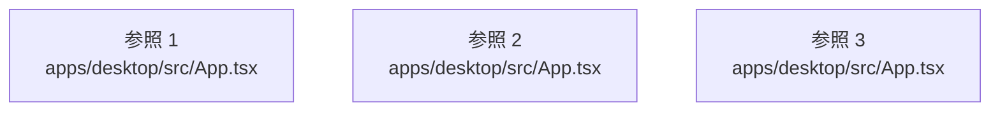

# dependency-map/group-1/n-apps-desktop-src-app-tsx-5f1345

[解析トップへ戻る](../../../README.md)

確認済みファイル: `apps/desktop/src/App.tsx`

解析: 字句抽出。静的なimport／export参照です。関数の実行順序やHTTP通信は表していません。

宣言: `ProactiveLayer`, `useWorkspaceConversation`, `ShellWithInspector`, `OpenTaskListener`, `ActivePage`, `MeetingSurfaceLayer`, `Workspace`, `App`

- `react` → 外部・標準ライブラリ・別名など。ローカル対応先は未確定
- `./state/ShellProvider.js` → `apps/desktop/src/state/ShellProvider.tsx`（一覧確認・内容未読）
- `./state/ThemeProvider.js` → `apps/desktop/src/state/ThemeProvider.tsx`（一覧確認・内容未読）
- `./state/SessionProvider.js` → `apps/desktop/src/state/SessionProvider.tsx`（一覧確認・内容未読）
- `@genie/api-client` → 外部・標準ライブラリ・別名など。ローカル対応先は未確定
- `./host/tauri.js` → `apps/desktop/src/host/tauri.ts`（一覧確認・内容未読）
- `./state/WorkspaceData.js` → `apps/desktop/src/state/WorkspaceData.tsx`（一覧確認・内容未読）
- `./auth/SignIn.js` → `apps/desktop/src/auth/SignIn.tsx`（一覧確認・内容未読）
- `./shell/AppShell.js` → `apps/desktop/src/shell/AppShell.tsx`（一覧確認・内容未読）
- `./shell/Composer.js` → `apps/desktop/src/shell/Composer.tsx`（一覧確認・内容未読）
- `./shell/TaskInspector.js` → `apps/desktop/src/shell/TaskInspector.tsx`（一覧確認・内容未読）
- `./pages/Home.js` → `apps/desktop/src/pages/Home.tsx`（一覧確認・内容未読）
- `./home/useProactive.js` → `apps/desktop/src/home/useProactive.ts`（一覧確認・内容未読）
- `./pages/Work.js` → `apps/desktop/src/pages/Work.tsx`（一覧確認・内容未読）
- `./pages/Library.js` → `apps/desktop/src/pages/Library.tsx`（一覧確認・内容未読）
- `./pages/Apps.js` → `apps/desktop/src/pages/Apps.tsx`（一覧確認・内容未読）
- `./meeting/MeetingProvider.js` → `apps/desktop/src/meeting/MeetingProvider.tsx`（一覧確認・内容未読）
- `./onboarding/Onboarding.js` → `apps/desktop/src/onboarding/Onboarding.tsx`（一覧確認・内容未読）
- `./meeting/MeetingLayer.js` → `apps/desktop/src/meeting/MeetingLayer.tsx`（一覧確認・内容未読）
- `./shell/shell.css` → `apps/desktop/src/shell/shell.css`（一覧確認・内容未読）

## 要素の説明

### imports-1

import参照の表示用グループ。

[詳細な図と説明を見る](imports-1/README.md)

### imports-2

import参照の表示用グループ。

[詳細な図と説明を見る](imports-2/README.md)

### imports-3

import参照の表示用グループ。

[詳細な図と説明を見る](imports-3/README.md)

