# dependency-map/group-1/n-apps-desktop-src-app-tsx-5f1345/imports-1

[解析トップへ戻る](../../../../README.md)

import参照の表示用グループ。

```mermaid
graph TD
    source["ソース\napps/desktop/src/App.tsx"]
    n-react-6b810c["react\n外部・別名・未解決"]
    source -->|"字句抽出: import／export"| n-react-6b810c
    n-state-shellprovider-js-56b7d5["./state/ShellProvider.js\napps/desktop/src/state/ShellProvider.tsx"]
    source -->|"字句抽出: import／export"| n-state-shellprovider-js-56b7d5
    n-state-themeprovider-js-988b32["./state/ThemeProvider.js\napps/desktop/src/state/ThemeProvider.tsx"]
    source -->|"字句抽出: import／export"| n-state-themeprovider-js-988b32
    n-state-sessionprovider-js-caac11["./state/SessionProvider.js\napps/desktop/src/state/SessionProvider.tsx"]
    source -->|"字句抽出: import／export"| n-state-sessionprovider-js-caac11
    n-genie-api-client-454c33["@genie/api-client\n外部・別名・未解決"]
    source -->|"字句抽出: import／export"| n-genie-api-client-454c33
    n-host-tauri-js-16ff75["./host/tauri.js\napps/desktop/src/host/tauri.ts"]
    source -->|"字句抽出: import／export"| n-host-tauri-js-16ff75
    n-state-workspacedata-js-e8bb53["./state/WorkspaceData.js\napps/desktop/src/state/WorkspaceData.tsx"]
    source -->|"字句抽出: import／export"| n-state-workspacedata-js-e8bb53
    n-auth-signin-js-32ef72["./auth/SignIn.js\napps/desktop/src/auth/SignIn.tsx"]
    source -->|"字句抽出: import／export"| n-auth-signin-js-32ef72
```

## 要素の説明

### n-auth-signin-js-32ef72

参照名: `./auth/SignIn.js`

対応する実在ソース: `apps/desktop/src/auth/SignIn.tsx`。内容は未読。

### n-genie-api-client-454c33

参照名: `@genie/api-client`

ローカルのソース対応先を確定できませんでした。外部ライブラリ、標準ライブラリ、型別名などを区別する追加確認が必要です。

### n-host-tauri-js-16ff75

参照名: `./host/tauri.js`

対応する実在ソース: `apps/desktop/src/host/tauri.ts`。内容は未読。

### n-react-6b810c

参照名: `react`

ローカルのソース対応先を確定できませんでした。外部ライブラリ、標準ライブラリ、型別名などを区別する追加確認が必要です。

### n-state-sessionprovider-js-caac11

参照名: `./state/SessionProvider.js`

対応する実在ソース: `apps/desktop/src/state/SessionProvider.tsx`。内容は未読。

### n-state-shellprovider-js-56b7d5

参照名: `./state/ShellProvider.js`

対応する実在ソース: `apps/desktop/src/state/ShellProvider.tsx`。内容は未読。

### n-state-themeprovider-js-988b32

参照名: `./state/ThemeProvider.js`

対応する実在ソース: `apps/desktop/src/state/ThemeProvider.tsx`。内容は未読。

### n-state-workspacedata-js-e8bb53

参照名: `./state/WorkspaceData.js`

対応する実在ソース: `apps/desktop/src/state/WorkspaceData.tsx`。内容は未読。

### source

`apps/desktop/src/App.tsx` の内容を確認しました。

