# dependency-map/group-1/n-apps-desktop-src-app-tsx-5f1345/imports-2

[解析トップへ戻る](../../../../README.md)

import参照の表示用グループ。

```mermaid
graph TD
    source["ソース\napps/desktop/src/App.tsx"]
    n-shell-appshell-js-ae18e1["./shell/AppShell.js\napps/desktop/src/shell/AppShell.tsx"]
    source -->|"字句抽出: import／export"| n-shell-appshell-js-ae18e1
    n-shell-composer-js-4dc0bb["./shell/Composer.js\napps/desktop/src/shell/Composer.tsx"]
    source -->|"字句抽出: import／export"| n-shell-composer-js-4dc0bb
    n-shell-taskinspector-js-0c9396["./shell/TaskInspector.js\napps/desktop/src/shell/TaskInspector.tsx"]
    source -->|"字句抽出: import／export"| n-shell-taskinspector-js-0c9396
    n-pages-home-js-f12d6b["./pages/Home.js\napps/desktop/src/pages/Home.tsx"]
    source -->|"字句抽出: import／export"| n-pages-home-js-f12d6b
    n-home-useproactive-js-1aa51a["./home/useProactive.js\napps/desktop/src/home/useProactive.ts"]
    source -->|"字句抽出: import／export"| n-home-useproactive-js-1aa51a
    n-pages-work-js-37b1c7["./pages/Work.js\napps/desktop/src/pages/Work.tsx"]
    source -->|"字句抽出: import／export"| n-pages-work-js-37b1c7
    n-pages-library-js-7fe613["./pages/Library.js\napps/desktop/src/pages/Library.tsx"]
    source -->|"字句抽出: import／export"| n-pages-library-js-7fe613
    n-pages-apps-js-ae8c58["./pages/Apps.js\napps/desktop/src/pages/Apps.tsx"]
    source -->|"字句抽出: import／export"| n-pages-apps-js-ae8c58
```

## 要素の説明

### n-home-useproactive-js-1aa51a

参照名: `./home/useProactive.js`

対応する実在ソース: `apps/desktop/src/home/useProactive.ts`。内容は未読。

### n-pages-apps-js-ae8c58

参照名: `./pages/Apps.js`

対応する実在ソース: `apps/desktop/src/pages/Apps.tsx`。内容は未読。

### n-pages-home-js-f12d6b

参照名: `./pages/Home.js`

対応する実在ソース: `apps/desktop/src/pages/Home.tsx`。内容は未読。

### n-pages-library-js-7fe613

参照名: `./pages/Library.js`

対応する実在ソース: `apps/desktop/src/pages/Library.tsx`。内容は未読。

### n-pages-work-js-37b1c7

参照名: `./pages/Work.js`

対応する実在ソース: `apps/desktop/src/pages/Work.tsx`。内容は未読。

### n-shell-appshell-js-ae18e1

参照名: `./shell/AppShell.js`

対応する実在ソース: `apps/desktop/src/shell/AppShell.tsx`。内容は未読。

### n-shell-composer-js-4dc0bb

参照名: `./shell/Composer.js`

対応する実在ソース: `apps/desktop/src/shell/Composer.tsx`。内容は未読。

### n-shell-taskinspector-js-0c9396

参照名: `./shell/TaskInspector.js`

対応する実在ソース: `apps/desktop/src/shell/TaskInspector.tsx`。内容は未読。

### source

`apps/desktop/src/App.tsx` の内容を確認しました。

