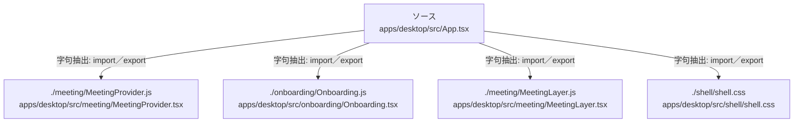

# dependency-map/group-1/n-apps-desktop-src-app-tsx-5f1345/imports-3

[解析トップへ戻る](../../../../README.md)

import参照の表示用グループ。

## 要素の説明

### n-meeting-meetinglayer-js-9aae3f

参照名: `./meeting/MeetingLayer.js`

対応する実在ソース: `apps/desktop/src/meeting/MeetingLayer.tsx`。内容は未読。

### n-meeting-meetingprovider-js-9071f4

参照名: `./meeting/MeetingProvider.js`

対応する実在ソース: `apps/desktop/src/meeting/MeetingProvider.tsx`。内容は未読。

### n-onboarding-onboarding-js-ae0c58

参照名: `./onboarding/Onboarding.js`

対応する実在ソース: `apps/desktop/src/onboarding/Onboarding.tsx`。内容は未読。

### n-shell-shell-css-3bcead

参照名: `./shell/shell.css`

対応する実在ソース: `apps/desktop/src/shell/shell.css`。内容は未読。

### source

`apps/desktop/src/App.tsx` の内容を確認しました。

