# dependency-map/group-1/n-apps-desktop-src-dock-dockapp-tsx-399b78/imports-1

[解析トップへ戻る](../../../../README.md)

import参照の表示用グループ。

```mermaid
graph TD
    source["ソース\napps/desktop/src/dock/DockApp.tsx"]
    n-react-6b810c["react\n外部・別名・未解決"]
    source -->|"字句抽出: import／export"| n-react-6b810c
    n-genie-api-client-454c33["@genie/api-client\n外部・別名・未解決"]
    source -->|"字句抽出: import／export"| n-genie-api-client-454c33
    n-genie-contracts-59272d["@genie/contracts\n外部・別名・未解決"]
    source -->|"字句抽出: import／export"| n-genie-contracts-59272d
    n-state-themeprovider-js-8e0918["../state/ThemeProvider.js\napps/desktop/src/state/ThemeProvider.tsx"]
    source -->|"字句抽出: import／export"| n-state-themeprovider-js-8e0918
    n-state-sessionprovider-js-5948aa["../state/SessionProvider.js\napps/desktop/src/state/SessionProvider.tsx"]
    source -->|"字句抽出: import／export"| n-state-sessionprovider-js-5948aa
    n-work-usetaskstream-js-5dcb75["../work/useTaskStream.js\napps/desktop/src/work/useTaskStream.ts"]
    source -->|"字句抽出: import／export"| n-work-usetaskstream-js-5dcb75
    n-host-tauri-js-262b28["../host/tauri.js\napps/desktop/src/host/tauri.ts"]
    source -->|"字句抽出: import／export"| n-host-tauri-js-262b28
    n-voice-voiceruntime-js-4b56cd["../voice/voiceRuntime.js\napps/desktop/src/voice/voiceRuntime.ts"]
    source -->|"字句抽出: import／export"| n-voice-voiceruntime-js-4b56cd
```

## 要素の説明

### n-genie-api-client-454c33

参照名: `@genie/api-client`

ローカルのソース対応先を確定できませんでした。外部ライブラリ、標準ライブラリ、型別名などを区別する追加確認が必要です。

### n-genie-contracts-59272d

参照名: `@genie/contracts`

ローカルのソース対応先を確定できませんでした。外部ライブラリ、標準ライブラリ、型別名などを区別する追加確認が必要です。

### n-host-tauri-js-262b28

参照名: `../host/tauri.js`

対応する実在ソース: `apps/desktop/src/host/tauri.ts`。内容は未読。

### n-react-6b810c

参照名: `react`

ローカルのソース対応先を確定できませんでした。外部ライブラリ、標準ライブラリ、型別名などを区別する追加確認が必要です。

### n-state-sessionprovider-js-5948aa

参照名: `../state/SessionProvider.js`

対応する実在ソース: `apps/desktop/src/state/SessionProvider.tsx`。内容は未読。

### n-state-themeprovider-js-8e0918

参照名: `../state/ThemeProvider.js`

対応する実在ソース: `apps/desktop/src/state/ThemeProvider.tsx`。内容は未読。

### n-voice-voiceruntime-js-4b56cd

参照名: `../voice/voiceRuntime.js`

対応する実在ソース: `apps/desktop/src/voice/voiceRuntime.ts`。内容は未読。

### n-work-usetaskstream-js-5dcb75

参照名: `../work/useTaskStream.js`

対応する実在ソース: `apps/desktop/src/work/useTaskStream.ts`。内容は未読。

### source

`apps/desktop/src/dock/DockApp.tsx` の内容を確認しました。

