# dependency-map/group-1/n-apps-desktop-src-dock-dockapp-tsx-399b78/imports-2

[解析トップへ戻る](../../../../README.md)

import参照の表示用グループ。

```mermaid
graph TD
    source["ソース\napps/desktop/src/dock/DockApp.tsx"]
    n-voice-demo-js-21dcb8["../voice/demo.js\napps/desktop/src/voice/demo.ts"]
    source -->|"字句抽出: import／export"| n-voice-demo-js-21dcb8
    n-work-approvaloutcome-js-7631e7["../work/approvalOutcome.js\napps/desktop/src/work/approvalOutcome.ts"]
    source -->|"字句抽出: import／export"| n-work-approvaloutcome-js-7631e7
    n-ux-metrics-js-d4ba99["../ux/metrics.js\napps/desktop/src/ux/metrics.ts"]
    source -->|"字句抽出: import／export"| n-ux-metrics-js-d4ba99
    n-taskdock-js-f26f4b["./TaskDock.js\napps/desktop/src/dock/TaskDock.tsx"]
    source -->|"字句抽出: import／export"| n-taskdock-js-f26f4b
    n-meeting-meetingbridge-js-99e295["../meeting/meetingBridge.js\napps/desktop/src/meeting/meetingBridge.ts"]
    source -->|"字句抽出: import／export"| n-meeting-meetingbridge-js-99e295
    n-usedockmachine-js-d621cc["./useDockMachine.js\napps/desktop/src/dock/useDockMachine.ts"]
    source -->|"字句抽出: import／export"| n-usedockmachine-js-d621cc
    n-dock-css-fe73d2["./dock.css\napps/desktop/src/dock/dock.css"]
    source -->|"字句抽出: import／export"| n-dock-css-fe73d2
```

## 要素の説明

### n-dock-css-fe73d2

参照名: `./dock.css`

対応する実在ソース: `apps/desktop/src/dock/dock.css`。内容は未読。

### n-meeting-meetingbridge-js-99e295

参照名: `../meeting/meetingBridge.js`

対応する実在ソース: `apps/desktop/src/meeting/meetingBridge.ts`。内容は未読。

### n-taskdock-js-f26f4b

参照名: `./TaskDock.js`

対応する実在ソース: `apps/desktop/src/dock/TaskDock.tsx`。内容は未読。

### n-usedockmachine-js-d621cc

参照名: `./useDockMachine.js`

対応する実在ソース: `apps/desktop/src/dock/useDockMachine.ts`。内容は未読。

### n-ux-metrics-js-d4ba99

参照名: `../ux/metrics.js`

対応する実在ソース: `apps/desktop/src/ux/metrics.ts`。内容は未読。

### n-voice-demo-js-21dcb8

参照名: `../voice/demo.js`

対応する実在ソース: `apps/desktop/src/voice/demo.ts`。内容は未読。

### n-work-approvaloutcome-js-7631e7

参照名: `../work/approvalOutcome.js`

対応する実在ソース: `apps/desktop/src/work/approvalOutcome.ts`。内容は未読。

### source

`apps/desktop/src/dock/DockApp.tsx` の内容を確認しました。

