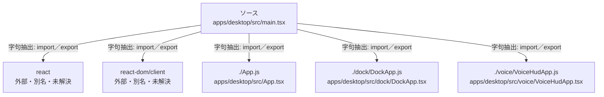

# dependency-map/group-1/n-apps-desktop-src-main-tsx-358da8

[解析トップへ戻る](../../../README.md)

確認済みファイル: `apps/desktop/src/main.tsx`

解析: 字句抽出。静的なimport／export参照です。関数の実行順序やHTTP通信は表していません。

- `react` → 外部・標準ライブラリ・別名など。ローカル対応先は未確定
- `react-dom/client` → 外部・標準ライブラリ・別名など。ローカル対応先は未確定
- `./App.js` → `apps/desktop/src/App.tsx`（内容確認済み）
- `./dock/DockApp.js` → `apps/desktop/src/dock/DockApp.tsx`（内容確認済み）
- `./voice/VoiceHudApp.js` → `apps/desktop/src/voice/VoiceHudApp.tsx`（内容確認済み）

## 要素の説明

### n-app-js-01bc69

参照名: `./App.js`

対応する実在ソース: `apps/desktop/src/App.tsx`。内容確認済み。

### n-dock-dockapp-js-c93d24

参照名: `./dock/DockApp.js`

対応する実在ソース: `apps/desktop/src/dock/DockApp.tsx`。内容確認済み。

### n-react-6b810c

参照名: `react`

ローカルのソース対応先を確定できませんでした。外部ライブラリ、標準ライブラリ、型別名などを区別する追加確認が必要です。

### n-react-dom-client-bcbcc9

参照名: `react-dom/client`

ローカルのソース対応先を確定できませんでした。外部ライブラリ、標準ライブラリ、型別名などを区別する追加確認が必要です。

### n-voice-voicehudapp-js-1402f0

参照名: `./voice/VoiceHudApp.js`

対応する実在ソース: `apps/desktop/src/voice/VoiceHudApp.tsx`。内容確認済み。

### source

`apps/desktop/src/main.tsx` の内容を確認しました。

