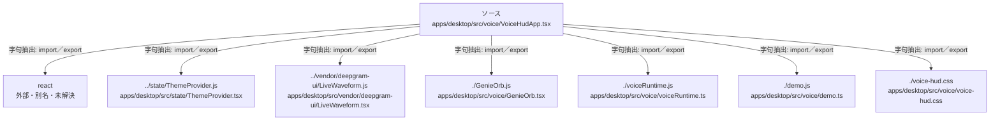

# dependency-map/group-1/n-apps-desktop-src-voice-voicehudapp-tsx-c46fc9

[解析トップへ戻る](../../../README.md)

確認済みファイル: `apps/desktop/src/voice/VoiceHudApp.tsx`

解析: 字句抽出。静的なimport／export参照です。関数の実行順序やHTTP通信は表していません。

宣言: `labelFor`, `VoiceHud`, `VoiceHudApp`

- `react` → 外部・標準ライブラリ・別名など。ローカル対応先は未確定
- `../state/ThemeProvider.js` → `apps/desktop/src/state/ThemeProvider.tsx`（一覧確認・内容未読）
- `../vendor/deepgram-ui/LiveWaveform.js` → `apps/desktop/src/vendor/deepgram-ui/LiveWaveform.tsx`（一覧確認・内容未読）
- `./GenieOrb.js` → `apps/desktop/src/voice/GenieOrb.tsx`（一覧確認・内容未読）
- `./voiceRuntime.js` → `apps/desktop/src/voice/voiceRuntime.ts`（一覧確認・内容未読）
- `./demo.js` → `apps/desktop/src/voice/demo.ts`（一覧確認・内容未読）
- `./voice-hud.css` → `apps/desktop/src/voice/voice-hud.css`（一覧確認・内容未読）

## 要素の説明

### n-demo-js-95f1c3

参照名: `./demo.js`

対応する実在ソース: `apps/desktop/src/voice/demo.ts`。内容は未読。

### n-genieorb-js-5cdf87

参照名: `./GenieOrb.js`

対応する実在ソース: `apps/desktop/src/voice/GenieOrb.tsx`。内容は未読。

### n-react-6b810c

参照名: `react`

ローカルのソース対応先を確定できませんでした。外部ライブラリ、標準ライブラリ、型別名などを区別する追加確認が必要です。

### n-state-themeprovider-js-8e0918

参照名: `../state/ThemeProvider.js`

対応する実在ソース: `apps/desktop/src/state/ThemeProvider.tsx`。内容は未読。

### n-vendor-deepgram-ui-livewaveform-js-036822

参照名: `../vendor/deepgram-ui/LiveWaveform.js`

対応する実在ソース: `apps/desktop/src/vendor/deepgram-ui/LiveWaveform.tsx`。内容は未読。

### n-voice-hud-css-305b02

参照名: `./voice-hud.css`

対応する実在ソース: `apps/desktop/src/voice/voice-hud.css`。内容は未読。

### n-voiceruntime-js-c12884

参照名: `./voiceRuntime.js`

対応する実在ソース: `apps/desktop/src/voice/voiceRuntime.ts`。内容は未読。

### source

`apps/desktop/src/voice/VoiceHudApp.tsx` の内容を確認しました。

