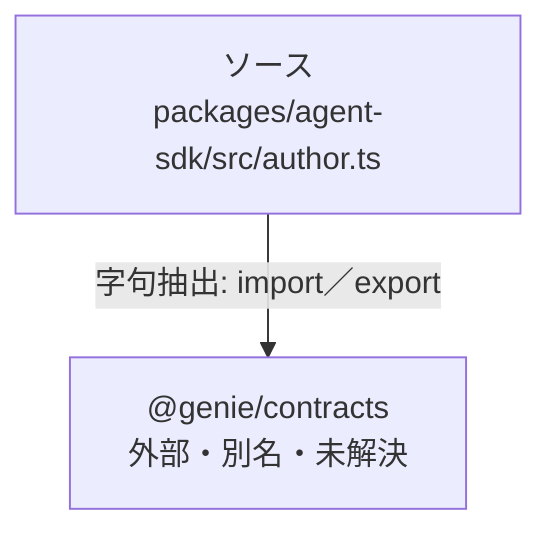

# dependency-map/group-1/n-packages-agent-sdk-src-author-ts-b116ad

[解析トップへ戻る](../../../README.md)

確認済みファイル: `packages/agent-sdk/src/author.ts`

解析: 字句抽出。静的なimport／export参照です。関数の実行順序やHTTP通信は表していません。

宣言: `ToolSpec`, `WorkflowStepSpec`, `AgentSpec`, `PackageDraft`, `Problem`, `review`, `BuiltPackage`, `build`, `buildEvaluations`, `toYaml`

- `@genie/contracts` → 外部・標準ライブラリ・別名など。ローカル対応先は未確定

## 要素の説明

### n-genie-contracts-59272d

参照名: `@genie/contracts`

ローカルのソース対応先を確定できませんでした。外部ライブラリ、標準ライブラリ、型別名などを区別する追加確認が必要です。

### source

`packages/agent-sdk/src/author.ts` の内容を確認しました。

