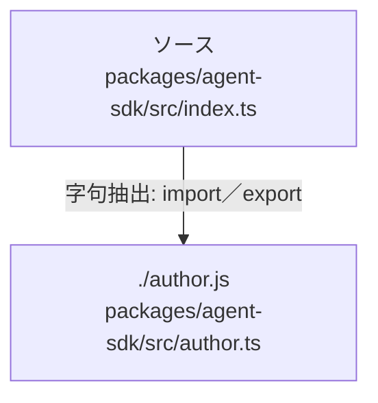

# dependency-map/group-1/n-packages-agent-sdk-src-index-ts-fdf8ec

[解析トップへ戻る](../../../README.md)

確認済みファイル: `packages/agent-sdk/src/index.ts`

解析: 字句抽出。静的なimport／export参照です。関数の実行順序やHTTP通信は表していません。

- `./author.js` → `packages/agent-sdk/src/author.ts`（内容確認済み）

## 要素の説明

### n-author-js-5ee4be

参照名: `./author.js`

対応する実在ソース: `packages/agent-sdk/src/author.ts`。内容確認済み。

### source

`packages/agent-sdk/src/index.ts` の内容を確認しました。

