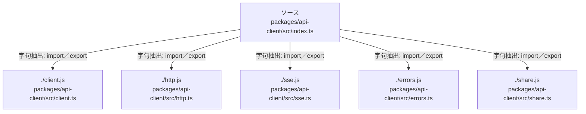

# dependency-map/group-1/n-packages-api-client-src-index-ts-cb2a91

[解析トップへ戻る](../../../README.md)

確認済みファイル: `packages/api-client/src/index.ts`

解析: 字句抽出。静的なimport／export参照です。関数の実行順序やHTTP通信は表していません。

- `./client.js` → `packages/api-client/src/client.ts`（内容確認済み）
- `./http.js` → `packages/api-client/src/http.ts`（内容確認済み）
- `./sse.js` → `packages/api-client/src/sse.ts`（内容確認済み）
- `./errors.js` → `packages/api-client/src/errors.ts`（内容確認済み）
- `./share.js` → `packages/api-client/src/share.ts`（内容確認済み）

## 要素の説明

### n-client-js-35af17

参照名: `./client.js`

対応する実在ソース: `packages/api-client/src/client.ts`。内容確認済み。

### n-errors-js-bf01ad

参照名: `./errors.js`

対応する実在ソース: `packages/api-client/src/errors.ts`。内容確認済み。

### n-http-js-d6393b

参照名: `./http.js`

対応する実在ソース: `packages/api-client/src/http.ts`。内容確認済み。

### n-share-js-26a1b7

参照名: `./share.js`

対応する実在ソース: `packages/api-client/src/share.ts`。内容確認済み。

### n-sse-js-aaf90e

参照名: `./sse.js`

対応する実在ソース: `packages/api-client/src/sse.ts`。内容確認済み。

### source

`packages/api-client/src/index.ts` の内容を確認しました。

