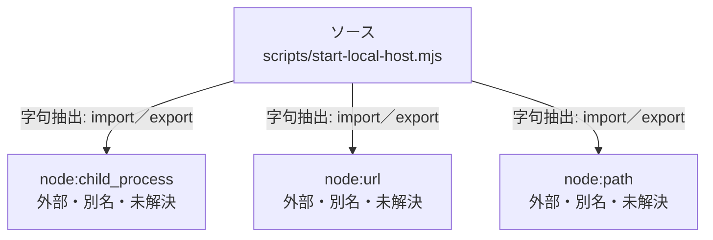

# dependency-map/group-1/n-scripts-start-local-host-mjs-a6fcae

[解析トップへ戻る](../../../README.md)

確認済みファイル: `scripts/start-local-host.mjs`

解析: 字句抽出。静的なimport／export参照です。関数の実行順序やHTTP通信は表していません。

宣言: `localURL`, `desktopEmail`, `jsonRequest`, `main`

- `node:child_process` → 外部・標準ライブラリ・別名など。ローカル対応先は未確定
- `node:url` → 外部・標準ライブラリ・別名など。ローカル対応先は未確定
- `node:path` → 外部・標準ライブラリ・別名など。ローカル対応先は未確定

## 要素の説明

### n-node-child-process-f62b7d

参照名: `node:child_process`

ローカルのソース対応先を確定できませんでした。外部ライブラリ、標準ライブラリ、型別名などを区別する追加確認が必要です。

### n-node-path-78811c

参照名: `node:path`

ローカルのソース対応先を確定できませんでした。外部ライブラリ、標準ライブラリ、型別名などを区別する追加確認が必要です。

### n-node-url-d0cb3a

参照名: `node:url`

ローカルのソース対応先を確定できませんでした。外部ライブラリ、標準ライブラリ、型別名などを区別する追加確認が必要です。

### source

`scripts/start-local-host.mjs` の内容を確認しました。

