# dependency-map/group-2

[解析トップへ戻る](../../README.md)

このグループは表示用の区切りです。独立した実行モジュールではありません。

```mermaid
graph TD
    n-packages-api-client-src-client-ts-aa50ab["client.ts\npackages/api-client/src/client.ts"]
    n-packages-api-client-src-http-ts-ee7ab7["http.ts\npackages/api-client/src/http.ts"]
    n-packages-api-client-src-sse-ts-4cda54["sse.ts\npackages/api-client/src/sse.ts"]
    n-packages-api-client-src-errors-ts-e14ec0["errors.ts\npackages/api-client/src/errors.ts"]
    n-packages-api-client-src-share-ts-1c6244["share.ts\npackages/api-client/src/share.ts"]
    n-services-agent-host-src-index-ts-df100d["index.ts\nservices/agent-host/src/index.ts"]
    n-services-agent-runtime-src-index-ts-defe94["index.ts\nservices/agent-runtime/src/index.ts"]
    n-services-api-gateway-src-index-ts-ea5519["index.ts\nservices/api-gateway/src/index.ts"]
```

## 要素の説明

### n-packages-api-client-src-client-ts-aa50ab

確認済みファイル: `packages/api-client/src/client.ts`

解析: 字句抽出。静的なimport／export参照です。関数の実行順序やHTTP通信は表していません。

宣言: `Page`, `TaskView`, `toView`, `GenieClient`

- `@genie/contracts` → 外部・標準ライブラリ・別名など。ローカル対応先は未確定
- `zod` → 外部・標準ライブラリ・別名など。ローカル対応先は未確定
- `./http.js` → `packages/api-client/src/http.ts`（内容確認済み）
- `./sse.js` → `packages/api-client/src/sse.ts`（内容確認済み）

[詳細な図と説明を見る](n-packages-api-client-src-client-ts-aa50ab/README.md)

### n-packages-api-client-src-errors-ts-e14ec0

確認済みファイル: `packages/api-client/src/errors.ts`

解析: 字句抽出。静的なimport／export参照です。関数の実行順序やHTTP通信は表していません。

宣言: `errorFrom`, `isRetryable`

- `@genie/contracts` → 外部・標準ライブラリ・別名など。ローカル対応先は未確定

[詳細な図と説明を見る](n-packages-api-client-src-errors-ts-e14ec0/README.md)

### n-packages-api-client-src-http-ts-ee7ab7

確認済みファイル: `packages/api-client/src/http.ts`

解析: 字句抽出。静的なimport／export参照です。関数の実行順序やHTTP通信は表していません。

宣言: `ClientConfig`, `RequestOptions`, `HttpClient`, `requireOk`

- `@genie/contracts` → 外部・標準ライブラリ・別名など。ローカル対応先は未確定
- `./errors.js` → `packages/api-client/src/errors.ts`（内容確認済み）

[詳細な図と説明を見る](n-packages-api-client-src-http-ts-ee7ab7/README.md)

### n-packages-api-client-src-share-ts-1c6244

確認済みファイル: `packages/api-client/src/share.ts`

解析: 字句抽出。静的なimport／export参照です。関数の実行順序やHTTP通信は表していません。

宣言: `PublicShareConfig`, `UnlockedShare`, `ShareUnavailableError`, `PublicShareClient`, `isRenderable`

- `@genie/contracts` → 外部・標準ライブラリ・別名など。ローカル対応先は未確定
- `zod` → 外部・標準ライブラリ・別名など。ローカル対応先は未確定

[詳細な図と説明を見る](n-packages-api-client-src-share-ts-1c6244/README.md)

### n-packages-api-client-src-sse-ts-4cda54

確認済みファイル: `packages/api-client/src/sse.ts`

解析: 字句抽出。静的なimport／export参照です。関数の実行順序やHTTP通信は表していません。

宣言: `StreamOptions`, `parseSseFrames`, `streamTaskEvents`, `streamMeetingEvents`, `streamEvents`, `readOnce`, `fetchWith`, `delay`

- `@genie/contracts` → 外部・標準ライブラリ・別名など。ローカル対応先は未確定
- `./http.js` → `packages/api-client/src/http.ts`（内容確認済み）

[詳細な図と説明を見る](n-packages-api-client-src-sse-ts-4cda54/README.md)

### n-services-agent-host-src-index-ts-df100d

確認済みファイル: `services/agent-host/src/index.ts`

解析: 字句抽出。静的なimport／export参照です。関数の実行順序やHTTP通信は表していません。

- `./service.js` → `services/agent-host/src/service.ts`（一覧確認・内容未読）
- `./bridge.js` → `services/agent-host/src/bridge.ts`（一覧確認・内容未読）
- `./step-executor.js` → `services/agent-host/src/step-executor.ts`（一覧確認・内容未読）

[詳細な図と説明を見る](n-services-agent-host-src-index-ts-df100d/README.md)

### n-services-agent-runtime-src-index-ts-defe94

確認済みファイル: `services/agent-runtime/src/index.ts`

解析: 字句抽出。静的なimport／export参照です。関数の実行順序やHTTP通信は表していません。

- `./domain.js` → `services/agent-runtime/src/domain.ts`（一覧確認・内容未読）
- `./sales-crm.js` → `services/agent-runtime/src/sales-crm.ts`（一覧確認・内容未読）
- `./data-sources.js` → `services/agent-runtime/src/data-sources.ts`（一覧確認・内容未読）
- `./definitions.js` → `services/agent-runtime/src/definitions.ts`（一覧確認・内容未読）
- `./image.js` → `services/agent-runtime/src/image.ts`（一覧確認・内容未読）
- `./media-factory.js` → `services/agent-runtime/src/media-factory.ts`（一覧確認・内容未読）
- `./video.js` → `services/agent-runtime/src/video.ts`（一覧確認・内容未読）
- `./video-executor.js` → `services/agent-runtime/src/video-executor.ts`（一覧確認・内容未読）
- `./care.js` → `services/agent-runtime/src/care.ts`（一覧確認・内容未読）
- `./care-executor.js` → `services/agent-runtime/src/care-executor.ts`（一覧確認・内容未読）
- `./ehr.js` → `services/agent-runtime/src/ehr.ts`（一覧確認・内容未読）
- `./ehr-executor.js` → `services/agent-runtime/src/ehr-executor.ts`（一覧確認・内容未読）
- `./architecture.js` → `services/agent-runtime/src/architecture.ts`（一覧確認・内容未読）
- `./architecture-executor.js` → `services/agent-runtime/src/architecture-executor.ts`（一覧確認・内容未読）
- `./stock.js` → `services/agent-runtime/src/stock.ts`（一覧確認・内容未読）
- `./stock-executor.js` → `services/agent-runtime/src/stock-executor.ts`（一覧確認・内容未読）
- `./imagen.js` → `services/agent-runtime/src/imagen.ts`（一覧確認・内容未読）
- `./sales-crm-executor.js` → `services/agent-runtime/src/sales-crm-executor.ts`（一覧確認・内容未読）

[詳細な図と説明を見る](n-services-agent-runtime-src-index-ts-defe94/README.md)

### n-services-api-gateway-src-index-ts-ea5519

確認済みファイル: `services/api-gateway/src/index.ts`

解析: 字句抽出。静的なimport／export参照です。関数の実行順序やHTTP通信は表していません。

- `./app.js` → `services/api-gateway/src/app.ts`（一覧確認・内容未読）
- `./fastify.js` → `services/api-gateway/src/fastify.ts`（一覧確認・内容未読）
- `./config.js` → `services/api-gateway/src/config.ts`（一覧確認・内容未読）
- `./errors.js` → `services/api-gateway/src/errors.ts`（一覧確認・内容未読）
- `./request-context.js` → `services/api-gateway/src/request-context.ts`（一覧確認・内容未読）
- `./plugins/request-id.js` → `services/api-gateway/src/plugins/request-id.ts`（一覧確認・内容未読）
- `./plugins/rate-limit.js` → `services/api-gateway/src/plugins/rate-limit.ts`（一覧確認・内容未読）
- `./rate-limit/index.js` → `services/api-gateway/src/rate-limit/index.ts`（一覧確認・内容未読）
- `./auth/tokens.js` → `services/api-gateway/src/auth/tokens.ts`（一覧確認・内容未読）
- `./auth/keys.js` → `services/api-gateway/src/auth/keys.ts`（一覧確認・内容未読）
- `./auth/middleware.js` → `services/api-gateway/src/auth/middleware.ts`（一覧確認・内容未読）
- `./routes/tasks.js` → `services/api-gateway/src/routes/tasks.ts`（一覧確認・内容未読）
- `./routes/artifacts.js` → `services/api-gateway/src/routes/artifacts.ts`（一覧確認・内容未読）
- `./routes/plugins.js` → `services/api-gateway/src/routes/plugins.ts`（一覧確認・内容未読）
- `./routes/shares.js` → `services/api-gateway/src/routes/shares.ts`（一覧確認・内容未読）
- `./host/bridge.js` → `services/api-gateway/src/host/bridge.ts`（一覧確認・内容未読）
- `./host/routes.js` → `services/api-gateway/src/host/routes.ts`（一覧確認・内容未読）
- `./routes/sse.js` → `services/api-gateway/src/routes/sse.ts`（一覧確認・内容未読）
- `./auth/sessions.js` → `services/api-gateway/src/auth/sessions.ts`（一覧確認・内容未読）

[詳細な図と説明を見る](n-services-api-gateway-src-index-ts-ea5519/README.md)

