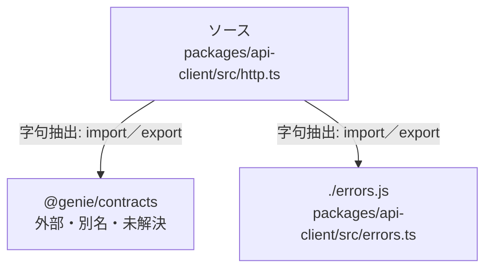

# dependency-map/group-2/n-packages-api-client-src-http-ts-ee7ab7

[解析トップへ戻る](../../../README.md)

確認済みファイル: `packages/api-client/src/http.ts`

解析: 字句抽出。静的なimport／export参照です。関数の実行順序やHTTP通信は表していません。

宣言: `ClientConfig`, `RequestOptions`, `HttpClient`, `requireOk`

- `@genie/contracts` → 外部・標準ライブラリ・別名など。ローカル対応先は未確定
- `./errors.js` → `packages/api-client/src/errors.ts`（内容確認済み）

## 要素の説明

### n-errors-js-bf01ad

参照名: `./errors.js`

対応する実在ソース: `packages/api-client/src/errors.ts`。内容確認済み。

### n-genie-contracts-59272d

参照名: `@genie/contracts`

ローカルのソース対応先を確定できませんでした。外部ライブラリ、標準ライブラリ、型別名などを区別する追加確認が必要です。

### source

`packages/api-client/src/http.ts` の内容を確認しました。

