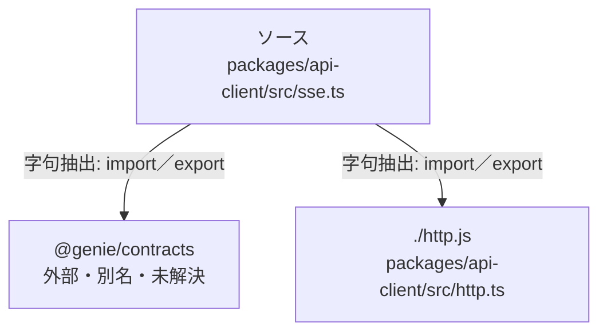

# dependency-map/group-2/n-packages-api-client-src-sse-ts-4cda54

[解析トップへ戻る](../../../README.md)

確認済みファイル: `packages/api-client/src/sse.ts`

解析: 字句抽出。静的なimport／export参照です。関数の実行順序やHTTP通信は表していません。

宣言: `StreamOptions`, `parseSseFrames`, `streamTaskEvents`, `streamMeetingEvents`, `streamEvents`, `readOnce`, `fetchWith`, `delay`

- `@genie/contracts` → 外部・標準ライブラリ・別名など。ローカル対応先は未確定
- `./http.js` → `packages/api-client/src/http.ts`（内容確認済み）

## 要素の説明

### n-genie-contracts-59272d

参照名: `@genie/contracts`

ローカルのソース対応先を確定できませんでした。外部ライブラリ、標準ライブラリ、型別名などを区別する追加確認が必要です。

### n-http-js-d6393b

参照名: `./http.js`

対応する実在ソース: `packages/api-client/src/http.ts`。内容確認済み。

### source

`packages/api-client/src/sse.ts` の内容を確認しました。

