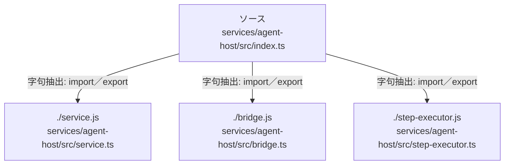

# dependency-map/group-2/n-services-agent-host-src-index-ts-df100d

[解析トップへ戻る](../../../README.md)

確認済みファイル: `services/agent-host/src/index.ts`

解析: 字句抽出。静的なimport／export参照です。関数の実行順序やHTTP通信は表していません。

- `./service.js` → `services/agent-host/src/service.ts`（一覧確認・内容未読）
- `./bridge.js` → `services/agent-host/src/bridge.ts`（一覧確認・内容未読）
- `./step-executor.js` → `services/agent-host/src/step-executor.ts`（一覧確認・内容未読）

## 要素の説明

### n-bridge-js-e0aa27

参照名: `./bridge.js`

対応する実在ソース: `services/agent-host/src/bridge.ts`。内容は未読。

### n-service-js-3f7e46

参照名: `./service.js`

対応する実在ソース: `services/agent-host/src/service.ts`。内容は未読。

### n-step-executor-js-8c838f

参照名: `./step-executor.js`

対応する実在ソース: `services/agent-host/src/step-executor.ts`。内容は未読。

### source

`services/agent-host/src/index.ts` の内容を確認しました。

