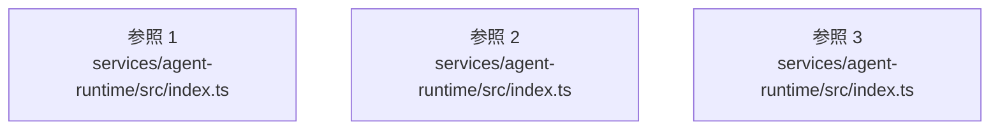

# dependency-map/group-2/n-services-agent-runtime-src-index-ts-defe94

[解析トップへ戻る](../../../README.md)

確認済みファイル: `services/agent-runtime/src/index.ts`

解析: 字句抽出。静的なimport／export参照です。関数の実行順序やHTTP通信は表していません。

- `./domain.js` → `services/agent-runtime/src/domain.ts`（一覧確認・内容未読）
- `./sales-crm.js` → `services/agent-runtime/src/sales-crm.ts`（一覧確認・内容未読）
- `./data-sources.js` → `services/agent-runtime/src/data-sources.ts`（一覧確認・内容未読）
- `./definitions.js` → `services/agent-runtime/src/definitions.ts`（一覧確認・内容未読）
- `./image.js` → `services/agent-runtime/src/image.ts`（一覧確認・内容未読）
- `./media-factory.js` → `services/agent-runtime/src/media-factory.ts`（一覧確認・内容未読）
- `./video.js` → `services/agent-runtime/src/video.ts`（一覧確認・内容未読）
- `./video-executor.js` → `services/agent-runtime/src/video-executor.ts`（一覧確認・内容未読）
- `./care.js` → `services/agent-runtime/src/care.ts`（一覧確認・内容未読）
- `./care-executor.js` → `services/agent-runtime/src/care-executor.ts`（一覧確認・内容未読）
- `./ehr.js` → `services/agent-runtime/src/ehr.ts`（一覧確認・内容未読）
- `./ehr-executor.js` → `services/agent-runtime/src/ehr-executor.ts`（一覧確認・内容未読）
- `./architecture.js` → `services/agent-runtime/src/architecture.ts`（一覧確認・内容未読）
- `./architecture-executor.js` → `services/agent-runtime/src/architecture-executor.ts`（一覧確認・内容未読）
- `./stock.js` → `services/agent-runtime/src/stock.ts`（一覧確認・内容未読）
- `./stock-executor.js` → `services/agent-runtime/src/stock-executor.ts`（一覧確認・内容未読）
- `./imagen.js` → `services/agent-runtime/src/imagen.ts`（一覧確認・内容未読）
- `./sales-crm-executor.js` → `services/agent-runtime/src/sales-crm-executor.ts`（一覧確認・内容未読）

## 要素の説明

### imports-1

import参照の表示用グループ。

[詳細な図と説明を見る](imports-1/README.md)

### imports-2

import参照の表示用グループ。

[詳細な図と説明を見る](imports-2/README.md)

### imports-3

import参照の表示用グループ。

[詳細な図と説明を見る](imports-3/README.md)

