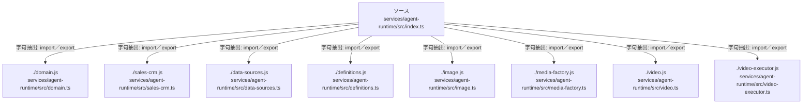

# dependency-map/group-2/n-services-agent-runtime-src-index-ts-defe94/imports-1

[解析トップへ戻る](../../../../README.md)

import参照の表示用グループ。

## 要素の説明

### n-data-sources-js-2f3509

参照名: `./data-sources.js`

対応する実在ソース: `services/agent-runtime/src/data-sources.ts`。内容は未読。

### n-definitions-js-87829c

参照名: `./definitions.js`

対応する実在ソース: `services/agent-runtime/src/definitions.ts`。内容は未読。

### n-domain-js-737f29

参照名: `./domain.js`

対応する実在ソース: `services/agent-runtime/src/domain.ts`。内容は未読。

### n-image-js-dc4a65

参照名: `./image.js`

対応する実在ソース: `services/agent-runtime/src/image.ts`。内容は未読。

### n-media-factory-js-e68f7d

参照名: `./media-factory.js`

対応する実在ソース: `services/agent-runtime/src/media-factory.ts`。内容は未読。

### n-sales-crm-js-142d2f

参照名: `./sales-crm.js`

対応する実在ソース: `services/agent-runtime/src/sales-crm.ts`。内容は未読。

### n-video-executor-js-3f7796

参照名: `./video-executor.js`

対応する実在ソース: `services/agent-runtime/src/video-executor.ts`。内容は未読。

### n-video-js-1546bb

参照名: `./video.js`

対応する実在ソース: `services/agent-runtime/src/video.ts`。内容は未読。

### source

`services/agent-runtime/src/index.ts` の内容を確認しました。

