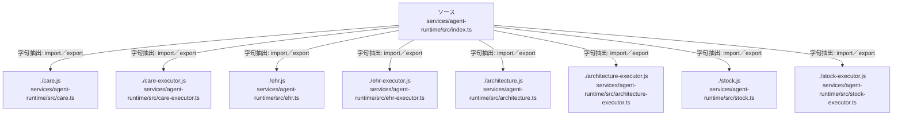

# dependency-map/group-2/n-services-agent-runtime-src-index-ts-defe94/imports-2

[解析トップへ戻る](../../../../README.md)

import参照の表示用グループ。

## 要素の説明

### n-architecture-executor-js-fe9d0d

参照名: `./architecture-executor.js`

対応する実在ソース: `services/agent-runtime/src/architecture-executor.ts`。内容は未読。

### n-architecture-js-b00798

参照名: `./architecture.js`

対応する実在ソース: `services/agent-runtime/src/architecture.ts`。内容は未読。

### n-care-executor-js-2b920c

参照名: `./care-executor.js`

対応する実在ソース: `services/agent-runtime/src/care-executor.ts`。内容は未読。

### n-care-js-ae49eb

参照名: `./care.js`

対応する実在ソース: `services/agent-runtime/src/care.ts`。内容は未読。

### n-ehr-executor-js-1076d4

参照名: `./ehr-executor.js`

対応する実在ソース: `services/agent-runtime/src/ehr-executor.ts`。内容は未読。

### n-ehr-js-e4145a

参照名: `./ehr.js`

対応する実在ソース: `services/agent-runtime/src/ehr.ts`。内容は未読。

### n-stock-executor-js-3b14c4

参照名: `./stock-executor.js`

対応する実在ソース: `services/agent-runtime/src/stock-executor.ts`。内容は未読。

### n-stock-js-3d97a5

参照名: `./stock.js`

対応する実在ソース: `services/agent-runtime/src/stock.ts`。内容は未読。

### source

`services/agent-runtime/src/index.ts` の内容を確認しました。

