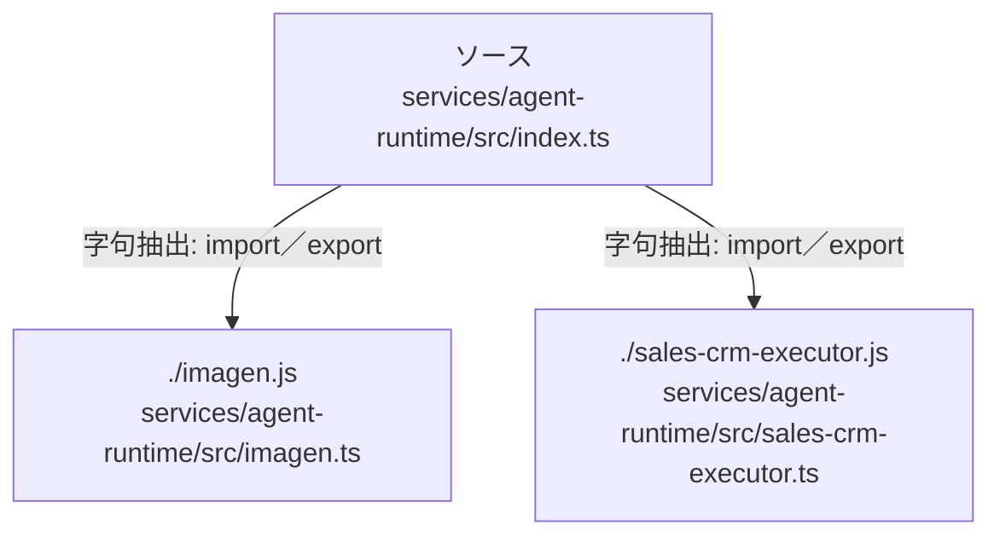

# dependency-map/group-2/n-services-agent-runtime-src-index-ts-defe94/imports-3

[解析トップへ戻る](../../../../README.md)

import参照の表示用グループ。

## 要素の説明

### n-imagen-js-d1054e

参照名: `./imagen.js`

対応する実在ソース: `services/agent-runtime/src/imagen.ts`。内容は未読。

### n-sales-crm-executor-js-49c4d2

参照名: `./sales-crm-executor.js`

対応する実在ソース: `services/agent-runtime/src/sales-crm-executor.ts`。内容は未読。

### source

`services/agent-runtime/src/index.ts` の内容を確認しました。

