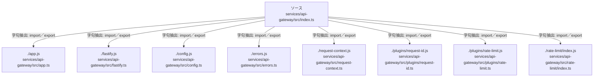

# dependency-map/group-2/n-services-api-gateway-src-index-ts-ea5519/imports-1

[解析トップへ戻る](../../../../README.md)

import参照の表示用グループ。

## 要素の説明

### n-app-js-ab7bbd

参照名: `./app.js`

対応する実在ソース: `services/api-gateway/src/app.ts`。内容は未読。

### n-config-js-d172e2

参照名: `./config.js`

対応する実在ソース: `services/api-gateway/src/config.ts`。内容は未読。

### n-errors-js-bf01ad

参照名: `./errors.js`

対応する実在ソース: `services/api-gateway/src/errors.ts`。内容は未読。

### n-fastify-js-6bf167

参照名: `./fastify.js`

対応する実在ソース: `services/api-gateway/src/fastify.ts`。内容は未読。

### n-plugins-rate-limit-js-ea288e

参照名: `./plugins/rate-limit.js`

対応する実在ソース: `services/api-gateway/src/plugins/rate-limit.ts`。内容は未読。

### n-plugins-request-id-js-816fbd

参照名: `./plugins/request-id.js`

対応する実在ソース: `services/api-gateway/src/plugins/request-id.ts`。内容は未読。

### n-rate-limit-index-js-22f2a9

参照名: `./rate-limit/index.js`

対応する実在ソース: `services/api-gateway/src/rate-limit/index.ts`。内容は未読。

### n-request-context-js-f3522b

参照名: `./request-context.js`

対応する実在ソース: `services/api-gateway/src/request-context.ts`。内容は未読。

### source

`services/api-gateway/src/index.ts` の内容を確認しました。

