# dependency-map/group-2/n-services-api-gateway-src-index-ts-ea5519/imports-2

[解析トップへ戻る](../../../../README.md)

import参照の表示用グループ。

```mermaid
graph TD
    source["ソース\nservices/api-gateway/src/index.ts"]
    n-auth-tokens-js-278b1f["./auth/tokens.js\nservices/api-gateway/src/auth/tokens.ts"]
    source -->|"字句抽出: import／export"| n-auth-tokens-js-278b1f
    n-auth-keys-js-d91270["./auth/keys.js\nservices/api-gateway/src/auth/keys.ts"]
    source -->|"字句抽出: import／export"| n-auth-keys-js-d91270
    n-auth-middleware-js-c07533["./auth/middleware.js\nservices/api-gateway/src/auth/middleware.ts"]
    source -->|"字句抽出: import／export"| n-auth-middleware-js-c07533
    n-routes-tasks-js-f92f35["./routes/tasks.js\nservices/api-gateway/src/routes/tasks.ts"]
    source -->|"字句抽出: import／export"| n-routes-tasks-js-f92f35
    n-routes-artifacts-js-fd6eaf["./routes/artifacts.js\nservices/api-gateway/src/routes/artifacts.ts"]
    source -->|"字句抽出: import／export"| n-routes-artifacts-js-fd6eaf
    n-routes-plugins-js-5d6633["./routes/plugins.js\nservices/api-gateway/src/routes/plugins.ts"]
    source -->|"字句抽出: import／export"| n-routes-plugins-js-5d6633
    n-routes-shares-js-98f541["./routes/shares.js\nservices/api-gateway/src/routes/shares.ts"]
    source -->|"字句抽出: import／export"| n-routes-shares-js-98f541
    n-host-bridge-js-f1dfe0["./host/bridge.js\nservices/api-gateway/src/host/bridge.ts"]
    source -->|"字句抽出: import／export"| n-host-bridge-js-f1dfe0
```

## 要素の説明

### n-auth-keys-js-d91270

参照名: `./auth/keys.js`

対応する実在ソース: `services/api-gateway/src/auth/keys.ts`。内容は未読。

### n-auth-middleware-js-c07533

参照名: `./auth/middleware.js`

対応する実在ソース: `services/api-gateway/src/auth/middleware.ts`。内容は未読。

### n-auth-tokens-js-278b1f

参照名: `./auth/tokens.js`

対応する実在ソース: `services/api-gateway/src/auth/tokens.ts`。内容は未読。

### n-host-bridge-js-f1dfe0

参照名: `./host/bridge.js`

対応する実在ソース: `services/api-gateway/src/host/bridge.ts`。内容は未読。

### n-routes-artifacts-js-fd6eaf

参照名: `./routes/artifacts.js`

対応する実在ソース: `services/api-gateway/src/routes/artifacts.ts`。内容は未読。

### n-routes-plugins-js-5d6633

参照名: `./routes/plugins.js`

対応する実在ソース: `services/api-gateway/src/routes/plugins.ts`。内容は未読。

### n-routes-shares-js-98f541

参照名: `./routes/shares.js`

対応する実在ソース: `services/api-gateway/src/routes/shares.ts`。内容は未読。

### n-routes-tasks-js-f92f35

参照名: `./routes/tasks.js`

対応する実在ソース: `services/api-gateway/src/routes/tasks.ts`。内容は未読。

### source

`services/api-gateway/src/index.ts` の内容を確認しました。

