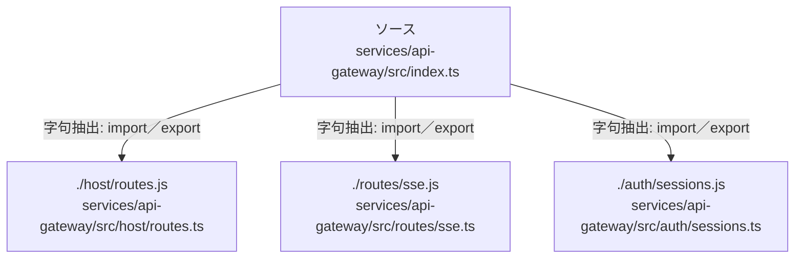

# dependency-map/group-2/n-services-api-gateway-src-index-ts-ea5519/imports-3

[解析トップへ戻る](../../../../README.md)

import参照の表示用グループ。

## 要素の説明

### n-auth-sessions-js-eb22c2

参照名: `./auth/sessions.js`

対応する実在ソース: `services/api-gateway/src/auth/sessions.ts`。内容は未読。

### n-host-routes-js-ba1ff0

参照名: `./host/routes.js`

対応する実在ソース: `services/api-gateway/src/host/routes.ts`。内容は未読。

### n-routes-sse-js-4117d1

参照名: `./routes/sse.js`

対応する実在ソース: `services/api-gateway/src/routes/sse.ts`。内容は未読。

### source

`services/api-gateway/src/index.ts` の内容を確認しました。

