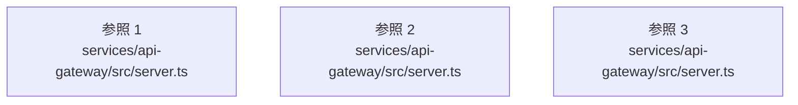

# dependency-map/group-3/n-services-api-gateway-src-server-ts-97fd2d

[解析トップへ戻る](../../../README.md)

確認済みファイル: `services/api-gateway/src/server.ts`

解析: 字句抽出。静的なimport／export参照です。関数の実行順序やHTTP通信は表していません。

宣言: `main`

- `ioredis` → 外部・標準ライブラリ・別名など。ローカル対応先は未確定
- `@genie/db` → 外部・標準ライブラリ・別名など。ローカル対応先は未確定
- `@genie/telemetry` → 外部・標準ライブラリ・別名など。ローカル対応先は未確定
- `@genie/service-library` → 外部・標準ライブラリ・別名など。ローカル対応先は未確定
- `@genie/service-task` → 外部・標準ライブラリ・別名など。ローカル対応先は未確定
- `@genie/service-plugin-registry` → 外部・標準ライブラリ・別名など。ローカル対応先は未確定
- `@genie/service-agent-runtime` → 外部・標準ライブラリ・別名など。ローカル対応先は未確定
- `@genie/service-agent-host` → 外部・標準ライブラリ・別名など。ローカル対応先は未確定
- `@genie/service-world-model` → 外部・標準ライブラリ・別名など。ローカル対応先は未確定
- `@genie/service-conversation` → 外部・標準ライブラリ・別名など。ローカル対応先は未確定
- `@genie/service-research` → 外部・標準ライブラリ・別名など。ローカル対応先は未確定
- `@genie/service-meeting` → 外部・標準ライブラリ・別名など。ローカル対応先は未確定
- `@genie/service-share` → 外部・標準ライブラリ・別名など。ローカル対応先は未確定
- `@genie/contracts` → 外部・標準ライブラリ・別名など。ローカル対応先は未確定
- `@genie/service-capabilities` → 外部・標準ライブラリ・別名など。ローカル対応先は未確定
- `./app.js` → `services/api-gateway/src/app.ts`（一覧確認・内容未読）
- `./config.js` → `services/api-gateway/src/config.ts`（一覧確認・内容未読）
- `./auth/keys.js` → `services/api-gateway/src/auth/keys.ts`（一覧確認・内容未読）
- `./auth/tokens.js` → `services/api-gateway/src/auth/tokens.ts`（一覧確認・内容未読）
- `./rate-limit/index.js` → `services/api-gateway/src/rate-limit/index.ts`（一覧確認・内容未読）

## 要素の説明

### imports-1

import参照の表示用グループ。

[詳細な図と説明を見る](imports-1/README.md)

### imports-2

import参照の表示用グループ。

[詳細な図と説明を見る](imports-2/README.md)

### imports-3

import参照の表示用グループ。

[詳細な図と説明を見る](imports-3/README.md)

