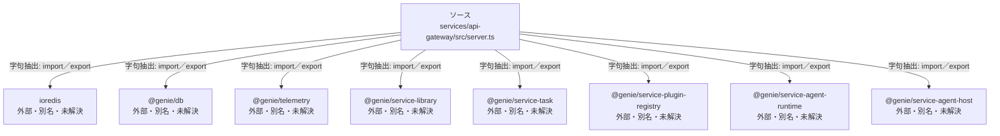

# dependency-map/group-3/n-services-api-gateway-src-server-ts-97fd2d/imports-1

[解析トップへ戻る](../../../../README.md)

import参照の表示用グループ。

## 要素の説明

### n-genie-db-6c8f01

参照名: `@genie/db`

ローカルのソース対応先を確定できませんでした。外部ライブラリ、標準ライブラリ、型別名などを区別する追加確認が必要です。

### n-genie-service-agent-host-834834

参照名: `@genie/service-agent-host`

ローカルのソース対応先を確定できませんでした。外部ライブラリ、標準ライブラリ、型別名などを区別する追加確認が必要です。

### n-genie-service-agent-runtime-dab0cd

参照名: `@genie/service-agent-runtime`

ローカルのソース対応先を確定できませんでした。外部ライブラリ、標準ライブラリ、型別名などを区別する追加確認が必要です。

### n-genie-service-library-df8516

参照名: `@genie/service-library`

ローカルのソース対応先を確定できませんでした。外部ライブラリ、標準ライブラリ、型別名などを区別する追加確認が必要です。

### n-genie-service-plugin-registry-61ff7e

参照名: `@genie/service-plugin-registry`

ローカルのソース対応先を確定できませんでした。外部ライブラリ、標準ライブラリ、型別名などを区別する追加確認が必要です。

### n-genie-service-task-8f74b4

参照名: `@genie/service-task`

ローカルのソース対応先を確定できませんでした。外部ライブラリ、標準ライブラリ、型別名などを区別する追加確認が必要です。

### n-genie-telemetry-3404d6

参照名: `@genie/telemetry`

ローカルのソース対応先を確定できませんでした。外部ライブラリ、標準ライブラリ、型別名などを区別する追加確認が必要です。

### n-ioredis-ef2a20

参照名: `ioredis`

ローカルのソース対応先を確定できませんでした。外部ライブラリ、標準ライブラリ、型別名などを区別する追加確認が必要です。

### source

`services/api-gateway/src/server.ts` の内容を確認しました。

