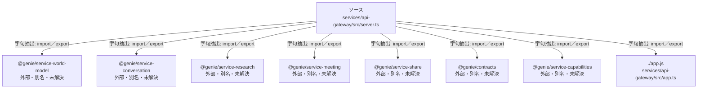

# dependency-map/group-3/n-services-api-gateway-src-server-ts-97fd2d/imports-2

[解析トップへ戻る](../../../../README.md)

import参照の表示用グループ。

## 要素の説明

### n-app-js-ab7bbd

参照名: `./app.js`

対応する実在ソース: `services/api-gateway/src/app.ts`。内容は未読。

### n-genie-contracts-59272d

参照名: `@genie/contracts`

ローカルのソース対応先を確定できませんでした。外部ライブラリ、標準ライブラリ、型別名などを区別する追加確認が必要です。

### n-genie-service-capabilities-fa287d

参照名: `@genie/service-capabilities`

ローカルのソース対応先を確定できませんでした。外部ライブラリ、標準ライブラリ、型別名などを区別する追加確認が必要です。

### n-genie-service-conversation-d8d934

参照名: `@genie/service-conversation`

ローカルのソース対応先を確定できませんでした。外部ライブラリ、標準ライブラリ、型別名などを区別する追加確認が必要です。

### n-genie-service-meeting-0f96ad

参照名: `@genie/service-meeting`

ローカルのソース対応先を確定できませんでした。外部ライブラリ、標準ライブラリ、型別名などを区別する追加確認が必要です。

### n-genie-service-research-0326ef

参照名: `@genie/service-research`

ローカルのソース対応先を確定できませんでした。外部ライブラリ、標準ライブラリ、型別名などを区別する追加確認が必要です。

### n-genie-service-share-9f133b

参照名: `@genie/service-share`

ローカルのソース対応先を確定できませんでした。外部ライブラリ、標準ライブラリ、型別名などを区別する追加確認が必要です。

### n-genie-service-world-model-d49043

参照名: `@genie/service-world-model`

ローカルのソース対応先を確定できませんでした。外部ライブラリ、標準ライブラリ、型別名などを区別する追加確認が必要です。

### source

`services/api-gateway/src/server.ts` の内容を確認しました。

