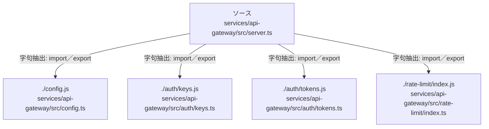

# dependency-map/group-3/n-services-api-gateway-src-server-ts-97fd2d/imports-3

[解析トップへ戻る](../../../../README.md)

import参照の表示用グループ。

## 要素の説明

### n-auth-keys-js-d91270

参照名: `./auth/keys.js`

対応する実在ソース: `services/api-gateway/src/auth/keys.ts`。内容は未読。

### n-auth-tokens-js-278b1f

参照名: `./auth/tokens.js`

対応する実在ソース: `services/api-gateway/src/auth/tokens.ts`。内容は未読。

### n-config-js-d172e2

参照名: `./config.js`

対応する実在ソース: `services/api-gateway/src/config.ts`。内容は未読。

### n-rate-limit-index-js-22f2a9

参照名: `./rate-limit/index.js`

対応する実在ソース: `services/api-gateway/src/rate-limit/index.ts`。内容は未読。

### source

`services/api-gateway/src/server.ts` の内容を確認しました。

