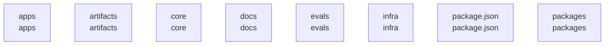

# overall-architecture/group-1

[解析トップへ戻る](../../README.md)

このグループは表示用の区切りです。独立した実行モジュールではありません。

## 要素の説明

### n-apps-802508

確認したパス: `apps`。配下の登録ファイルは454件。

- `apps/browser-extension/README.md`（一覧のみ）
- `apps/browser-extension/manifest.json`（一覧のみ）
- `apps/browser-extension/src/background.js`（一覧のみ）
- `apps/browser-extension/src/content.js`（一覧のみ）
- `apps/desktop/README.md`（一覧のみ）
- `apps/desktop/index.html`（一覧のみ）
- `apps/desktop/package.json`（内容確認済み）
- `apps/desktop/public/third-party/LiquidOrb-LICENSE.txt`（一覧のみ）
- `apps/desktop/src-tauri/.gitignore`（一覧のみ）
- `apps/desktop/src-tauri/Cargo.lock`（一覧のみ）
- `apps/desktop/src-tauri/Cargo.toml`（一覧のみ）
- `apps/desktop/src-tauri/Info.plist`（一覧のみ）
- `apps/desktop/src-tauri/build.rs`（一覧のみ）
- `apps/desktop/src-tauri/capabilities/default.json`（一覧のみ）
- `apps/desktop/src-tauri/icons/128x128.png`（一覧のみ）
- `apps/desktop/src-tauri/icons/128x128@2x.png`（一覧のみ）
- `apps/desktop/src-tauri/icons/32x32.png`（一覧のみ）
- `apps/desktop/src-tauri/icons/64x64.png`（一覧のみ）
- `apps/desktop/src-tauri/icons/Square107x107Logo.png`（一覧のみ）
- `apps/desktop/src-tauri/icons/Square142x142Logo.png`（一覧のみ）
- `apps/desktop/src-tauri/icons/Square150x150Logo.png`（一覧のみ）
- `apps/desktop/src-tauri/icons/Square284x284Logo.png`（一覧のみ）
- `apps/desktop/src-tauri/icons/Square30x30Logo.png`（一覧のみ）
- `apps/desktop/src-tauri/icons/Square310x310Logo.png`（一覧のみ）
- `apps/desktop/src-tauri/icons/Square44x44Logo.png`（一覧のみ）
- `apps/desktop/src-tauri/icons/Square71x71Logo.png`（一覧のみ）
- `apps/desktop/src-tauri/icons/Square89x89Logo.png`（一覧のみ）
- `apps/desktop/src-tauri/icons/StoreLogo.png`（一覧のみ）
- `apps/desktop/src-tauri/icons/icon.icns`（一覧のみ）
- `apps/desktop/src-tauri/icons/icon.ico`（一覧のみ）
- `apps/desktop/src-tauri/icons/icon.png`（一覧のみ）
- `apps/desktop/src-tauri/src/audio/capture.rs`（一覧のみ）
- `apps/desktop/src-tauri/src/audio/frame.rs`（一覧のみ）
- `apps/desktop/src-tauri/src/audio/mod.rs`（一覧のみ）
- `apps/desktop/src-tauri/src/audio/resample.rs`（一覧のみ）

[詳細な図と説明を見る](n-apps-802508/README.md)

### n-artifacts-3dc528

確認したパス: `artifacts`。配下の登録ファイルは237件。

- `artifacts/ux/J04/base/01-detected.png`（一覧のみ）
- `artifacts/ux/J04/base/02-recording.png`（一覧のみ）
- `artifacts/ux/J04/base/ffmpeg.log`（一覧のみ）
- `artifacts/ux/J04/base/ocr/01-detected.txt`（一覧のみ）
- `artifacts/ux/J04/base/ocr/02-recording.txt`（一覧のみ）
- `artifacts/ux/J04/base/result.json`（一覧のみ）
- `artifacts/ux/J04/base/stdout.txt`（一覧のみ）
- `artifacts/ux/J04/base/window-rect.txt`（一覧のみ）
- `artifacts/ux/J05/base/01-start.png`（一覧のみ）
- `artifacts/ux/J05/base/02-notes.png`（一覧のみ）
- `artifacts/ux/J05/base/judge-1.json`（一覧のみ）
- `artifacts/ux/J05/base/judge-2.json`（一覧のみ）
- `artifacts/ux/J05/base/judge-3.json`（一覧のみ）
- `artifacts/ux/J05/base/ocr/01-start.txt`（一覧のみ）
- `artifacts/ux/J05/base/ocr/02-notes.txt`（一覧のみ）
- `artifacts/ux/J05/base/result.json`（一覧のみ）
- `artifacts/ux/J05/base/scores.json`（一覧のみ）
- `artifacts/ux/J05/base/stdout.txt`（一覧のみ）
- `artifacts/ux/J05/base/video-judge.json`（一覧のみ）
- `artifacts/ux/J07/base/01-終わったあと.png`（一覧のみ）
- `artifacts/ux/J07/base/data/astra.sqlite`（一覧のみ）
- `artifacts/ux/J07/base/data/astra.sqlite-shm`（一覧のみ）
- `artifacts/ux/J07/base/data/astra.sqlite-wal`（一覧のみ）
- `artifacts/ux/J07/base/judge-1.json`（一覧のみ）
- `artifacts/ux/J07/base/judge-2.json`（一覧のみ）
- `artifacts/ux/J07/base/judge-3.json`（一覧のみ）
- `artifacts/ux/J07/base/ocr/01-終わったあと.txt`（一覧のみ）
- `artifacts/ux/J07/base/result.json`（一覧のみ）
- `artifacts/ux/J07/base/scores.json`（一覧のみ）
- `artifacts/ux/J07/base/stdout.txt`（一覧のみ）
- `artifacts/ux/J09/base/01-拾ったあと.png`（一覧のみ）
- `artifacts/ux/J09/base/02-原文を開いた.png`（一覧のみ）
- `artifacts/ux/J09/base/03-消したあと.png`（一覧のみ）
- `artifacts/ux/J09/base/ocr/01-拾ったあと.txt`（一覧のみ）
- `artifacts/ux/J09/base/ocr/02-原文を開いた.txt`（一覧のみ）

### n-core-94a042

確認したパス: `core`。配下の登録ファイルは14件。

- `core/genie-core/Cargo.lock`（一覧のみ）
- `core/genie-core/Cargo.toml`（一覧のみ）
- `core/genie-core/include/genie_core.h`（一覧のみ）
- `core/genie-core/src/api.rs`（一覧のみ）
- `core/genie-core/src/bin/uniffi-bindgen.rs`（一覧のみ）
- `core/genie-core/src/capi.rs`（一覧のみ）
- `core/genie-core/src/connector.rs`（一覧のみ）
- `core/genie-core/src/context.rs`（一覧のみ）
- `core/genie-core/src/lib.rs`（一覧のみ）
- `core/genie-core/src/mode.rs`（一覧のみ）
- `core/genie-core/src/oauth.rs`（一覧のみ）
- `core/genie-core/src/recording.rs`（一覧のみ）
- `core/genie-core/src/session.rs`（一覧のみ）
- `core/genie-core/src/transcript.rs`（一覧のみ）

### n-docs-71ab8b

確認したパス: `docs`。配下の登録ファイルは2373件。

- `docs/ASTRA_UIUX_TEST_SPEC_v1.0.md`（一覧のみ）
- `docs/ASTRA_UX_PRINCIPLES.md`（一覧のみ）
- `docs/COMPUTER_USE.md`（一覧のみ）
- `docs/COMPUTER_VISION.md`（一覧のみ）
- `docs/CONNECTIONS.md`（一覧のみ）
- `docs/CONSUMER_JOURNEYS.md`（一覧のみ）
- `docs/DESIGN_SYSTEM.md`（一覧のみ）
- `docs/ENTERPRISE_READINESS.md`（一覧のみ）
- `docs/FIRST_RUN.md`（一覧のみ）
- `docs/GENIE_RENAME.md`（一覧のみ）
- `docs/LOCAL_PREVIEW.ja.md`（一覧のみ）
- `docs/LOCAL_PREVIEW.md`（一覧のみ）
- `docs/MANAGED_PREVIEW.ja.md`（一覧のみ）
- `docs/MANAGED_PREVIEW.md`（一覧のみ）
- `docs/README.ja.md`（一覧のみ）
- `docs/README.md`（一覧のみ）
- `docs/TESTING.ja.md`（一覧のみ）
- `docs/TESTING.md`（一覧のみ）
- `docs/adr/0001-modular-monolith-deployment.md`（一覧のみ）
- `docs/adr/0002-sql-first-schema.md`（一覧のみ）
- `docs/adr/0003-sse-for-server-streams.md`（一覧のみ）
- `docs/adr/0004-fastify-as-the-http-layer.md`（一覧のみ）
- `docs/adr/README.md`（一覧のみ）
- `docs/closing-remaining-conditions.md`（一覧のみ）
- `docs/content/zenn/RESEARCH.md`（一覧のみ）
- `docs/content/zenn/genie-mac-workspace.md`（一覧のみ）
- `docs/content/zenn/publication.json`（一覧のみ）
- `docs/deepnote-audio-stt-migration.md`（一覧のみ）
- `docs/evidence/api-cost-audit/RESULTS.md`（一覧のみ）
- `docs/evidence/cloud-transcription/README.md`（一覧のみ）
- `docs/evidence/cloud-transcription/long-japanese.json`（一覧のみ）
- `docs/evidence/cloud-transcription/short-japanese.json`（一覧のみ）
- `docs/evidence/codex-cli.md`（一覧のみ）
- `docs/evidence/connections-completion/RESULTS.md`（一覧のみ）
- `docs/evidence/connectors-and-host.md`（一覧のみ）

[詳細な図と説明を見る](n-docs-71ab8b/README.md)

### n-evals-64bacb

確認したパス: `evals`。配下の登録ファイルは51件。

- `evals/README.md`（一覧のみ）
- `evals/actions/agent-host/acceptance.test.ts`（一覧のみ）
- `evals/actions/agent-host/meta.yaml`（一覧のみ）
- `evals/actions/care/acceptance.test.ts`（一覧のみ）
- `evals/actions/care/meta.yaml`（一覧のみ）
- `evals/actions/connectors/acceptance.test.ts`（一覧のみ）
- `evals/actions/connectors/bridge.test.ts`（一覧のみ）
- `evals/actions/connectors/meta.yaml`（一覧のみ）
- `evals/actions/connectors/oauth-e2e.test.ts`（一覧のみ）
- `evals/actions/connectors/tool-coverage.test.ts`（一覧のみ）
- `evals/actions/conversation/long.test.ts`（一覧のみ）
- `evals/actions/conversation/meta.yaml`（一覧のみ）
- `evals/actions/domain-agents/acceptance.test.ts`（一覧のみ）
- `evals/actions/domain-agents/meta.yaml`（一覧のみ）
- `evals/actions/ehr/acceptance.test.ts`（一覧のみ）
- `evals/actions/ehr/meta.yaml`（一覧のみ）
- `evals/actions/final/approval-expiry.test.ts`（一覧のみ）
- `evals/actions/final/background-work.test.ts`（一覧のみ）
- `evals/actions/final/calendar-gmail-chain.test.ts`（一覧のみ）
- `evals/actions/final/chaos.test.ts`（一覧のみ）
- `evals/actions/final/e2e.test.ts`（一覧のみ）
- `evals/actions/final/meta.yaml`（一覧のみ）
- `evals/actions/phase0/acceptance.test.ts`（一覧のみ）
- `evals/actions/phase0/meta.yaml`（一覧のみ）
- `evals/actions/phase2/acceptance.test.ts`（一覧のみ）
- `evals/actions/phase2/meta.yaml`（一覧のみ）
- `evals/actions/phase3/acceptance.test.ts`（一覧のみ）
- `evals/actions/phase3/meta.yaml`（一覧のみ）
- `evals/actions/phase4/acceptance.test.ts`（一覧のみ）
- `evals/actions/phase4/meta.yaml`（一覧のみ）
- `evals/actions/phase5/acceptance.test.ts`（一覧のみ）
- `evals/actions/phase5/meta.yaml`（一覧のみ）
- `evals/actions/phase6/acceptance.test.ts`（一覧のみ）
- `evals/actions/phase6/meta.yaml`（一覧のみ）
- `evals/actions/phase7/acceptance.test.ts`（一覧のみ）

[詳細な図と説明を見る](n-evals-64bacb/README.md)

### n-infra-5e03a5

確認したパス: `infra`。配下の登録ファイルは38件。

- `infra/cloudrun/README.md`（一覧のみ）
- `infra/db/README.md`（一覧のみ）
- `infra/db/bootstrap.sql`（一覧のみ）
- `infra/db/migrations/20260826010001_extensions.sql`（一覧のみ）
- `infra/db/migrations/20260826010002_identity.sql`（一覧のみ）
- `infra/db/migrations/20260826010003_conversations.sql`（一覧のみ）
- `infra/db/migrations/20260826010004_tasks.sql`（一覧のみ）
- `infra/db/migrations/20260826010005_library.sql`（一覧のみ）
- `infra/db/migrations/20260826010006_plugins.sql`（一覧のみ）
- `infra/db/migrations/20260826010007_audit.sql`（一覧のみ）
- `infra/db/migrations/20260826010008_rls.sql`（一覧のみ）
- `infra/db/migrations/20260826020001_shares.sql`（一覧のみ）
- `infra/db/migrations/20260826020002_research.sql`（一覧のみ）
- `infra/db/migrations/20260826030001_meetings.sql`（一覧のみ）
- `infra/db/migrations/20260826040001_plugin_assets.sql`（一覧のみ）
- `infra/db/migrations/20260826050001_agent_packages.sql`（一覧のみ）
- `infra/db/migrations/20260826060001_world_model.sql`（一覧のみ）
- `infra/db/migrations/20260827010001_conversation_state.sql`（一覧のみ）
- `infra/db/migrations/20260827020001_onboarding.sql`（一覧のみ）
- `infra/db/migrations/20260827030001_connections.sql`（一覧のみ）
- `infra/db/migrations/20260827040001_workflow_assets.sql`（一覧のみ）
- `infra/db/migrations/20260827050001_receipt_step.sql`（一覧のみ）
- `infra/db/migrations/20260827060001_attention_feedback.sql`（一覧のみ）
- `infra/db/migrations/20260827070001_agent_hosts.sql`（一覧のみ）
- `infra/db/migrations/20260827090000_host_step_requests.sql`（一覧のみ）
- `infra/db/migrations/20260827093000_host_step_request_key.sql`（一覧のみ）
- `infra/db/migrations/20260827103000_meeting_segment_source.sql`（一覧のみ）
- `infra/db/migrations/20260827120000_evidence_provenance.sql`（一覧のみ）
- `infra/db/migrations/20260827150000_user_identities.sql`（一覧のみ）
- `infra/db/migrations/20260907090000_work_context.sql`（一覧のみ）
- `infra/db/migrations/20260907170000_work_sync_cursor.sql`（一覧のみ）
- `infra/db/migrations/20260909120000_initial_profiles.sql`（一覧のみ）
- `infra/db/migrations/20260910003000_initial_profile_snapshot.sql`（一覧のみ）
- `infra/db/schema.sql`（一覧のみ）
- `infra/db/verify.sh`（一覧のみ）

[詳細な図と説明を見る](n-infra-5e03a5/README.md)

### n-package-json-7030d0

確認したパス: `package.json`。配下の登録ファイルは1件。

- `package.json`（内容確認済み）

### n-packages-d8ae08

確認したパス: `packages`。配下の登録ファイルは162件。

- `packages/agent-sdk/package.json`（一覧のみ）
- `packages/agent-sdk/src/author.ts`（内容確認済み）
- `packages/agent-sdk/src/index.ts`（内容確認済み）
- `packages/agent-sdk/test/author.test.ts`（一覧のみ）
- `packages/agent-sdk/tsconfig.json`（一覧のみ）
- `packages/api-client/package.json`（一覧のみ）
- `packages/api-client/src/client.ts`（内容確認済み）
- `packages/api-client/src/errors.ts`（内容確認済み）
- `packages/api-client/src/http.ts`（内容確認済み）
- `packages/api-client/src/index.ts`（内容確認済み）
- `packages/api-client/src/share.ts`（内容確認済み）
- `packages/api-client/src/sse.ts`（内容確認済み）
- `packages/api-client/test/client.test.ts`（一覧のみ）
- `packages/api-client/tsconfig.json`（一覧のみ）
- `packages/audio/package.json`（一覧のみ）
- `packages/audio/src/capture.ts`（一覧のみ）
- `packages/audio/src/frame.ts`（一覧のみ）
- `packages/audio/src/index.ts`（一覧のみ）
- `packages/audio/src/mix.ts`（一覧のみ）
- `packages/audio/test/frame.test.ts`（一覧のみ）
- `packages/audio/tsconfig.json`（一覧のみ）
- `packages/contracts/package.json`（一覧のみ）
- `packages/contracts/src/agent-host.ts`（一覧のみ）
- `packages/contracts/src/api.ts`（一覧のみ）
- `packages/contracts/src/approval.ts`（一覧のみ）
- `packages/contracts/src/artifact.ts`（一覧のみ）
- `packages/contracts/src/canonical.ts`（一覧のみ）
- `packages/contracts/src/codec.ts`（一覧のみ）
- `packages/contracts/src/context.ts`（一覧のみ）
- `packages/contracts/src/conversation.ts`（一覧のみ）
- `packages/contracts/src/dashboard.ts`（一覧のみ）
- `packages/contracts/src/domain.ts`（一覧のみ）
- `packages/contracts/src/errors.ts`（一覧のみ）
- `packages/contracts/src/escalation.ts`（一覧のみ）
- `packages/contracts/src/events.ts`（一覧のみ）

[詳細な図と説明を見る](n-packages-d8ae08/README.md)

