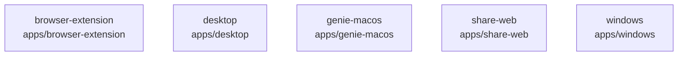

# overall-architecture/group-1/n-apps-802508

[解析トップへ戻る](../../../README.md)

確認したパス: `apps`。配下の登録ファイルは454件。

- `apps/browser-extension/README.md`（一覧のみ）
- `apps/browser-extension/manifest.json`（一覧のみ）
- `apps/browser-extension/src/background.js`（一覧のみ）
- `apps/browser-extension/src/content.js`（一覧のみ）
- `apps/desktop/README.md`（一覧のみ）
- `apps/desktop/index.html`（一覧のみ）
- `apps/desktop/package.json`（内容確認済み）
- `apps/desktop/public/third-party/LiquidOrb-LICENSE.txt`（一覧のみ）
- `apps/desktop/src-tauri/.gitignore`（一覧のみ）
- `apps/desktop/src-tauri/Cargo.lock`（一覧のみ）
- `apps/desktop/src-tauri/Cargo.toml`（一覧のみ）
- `apps/desktop/src-tauri/Info.plist`（一覧のみ）
- `apps/desktop/src-tauri/build.rs`（一覧のみ）
- `apps/desktop/src-tauri/capabilities/default.json`（一覧のみ）
- `apps/desktop/src-tauri/icons/128x128.png`（一覧のみ）
- `apps/desktop/src-tauri/icons/128x128@2x.png`（一覧のみ）
- `apps/desktop/src-tauri/icons/32x32.png`（一覧のみ）
- `apps/desktop/src-tauri/icons/64x64.png`（一覧のみ）
- `apps/desktop/src-tauri/icons/Square107x107Logo.png`（一覧のみ）
- `apps/desktop/src-tauri/icons/Square142x142Logo.png`（一覧のみ）
- `apps/desktop/src-tauri/icons/Square150x150Logo.png`（一覧のみ）
- `apps/desktop/src-tauri/icons/Square284x284Logo.png`（一覧のみ）
- `apps/desktop/src-tauri/icons/Square30x30Logo.png`（一覧のみ）
- `apps/desktop/src-tauri/icons/Square310x310Logo.png`（一覧のみ）
- `apps/desktop/src-tauri/icons/Square44x44Logo.png`（一覧のみ）
- `apps/desktop/src-tauri/icons/Square71x71Logo.png`（一覧のみ）
- `apps/desktop/src-tauri/icons/Square89x89Logo.png`（一覧のみ）
- `apps/desktop/src-tauri/icons/StoreLogo.png`（一覧のみ）
- `apps/desktop/src-tauri/icons/icon.icns`（一覧のみ）
- `apps/desktop/src-tauri/icons/icon.ico`（一覧のみ）
- `apps/desktop/src-tauri/icons/icon.png`（一覧のみ）
- `apps/desktop/src-tauri/src/audio/capture.rs`（一覧のみ）
- `apps/desktop/src-tauri/src/audio/frame.rs`（一覧のみ）
- `apps/desktop/src-tauri/src/audio/mod.rs`（一覧のみ）
- `apps/desktop/src-tauri/src/audio/resample.rs`（一覧のみ）

## 要素の説明

### n-apps-browser-extension-81dab3

実在パス: `apps/browser-extension`。4ファイル。

- `apps/browser-extension/README.md`
- `apps/browser-extension/manifest.json`
- `apps/browser-extension/src/background.js`
- `apps/browser-extension/src/content.js`

### n-apps-desktop-27ce27

実在パス: `apps/desktop`。198ファイル。

- `apps/desktop/README.md`
- `apps/desktop/index.html`
- `apps/desktop/package.json`
- `apps/desktop/public/third-party/LiquidOrb-LICENSE.txt`
- `apps/desktop/src-tauri/.gitignore`
- `apps/desktop/src-tauri/Cargo.lock`
- `apps/desktop/src-tauri/Cargo.toml`
- `apps/desktop/src-tauri/Info.plist`
- `apps/desktop/src-tauri/build.rs`
- `apps/desktop/src-tauri/capabilities/default.json`
- `apps/desktop/src-tauri/icons/128x128.png`
- `apps/desktop/src-tauri/icons/128x128@2x.png`
- `apps/desktop/src-tauri/icons/32x32.png`
- `apps/desktop/src-tauri/icons/64x64.png`
- `apps/desktop/src-tauri/icons/Square107x107Logo.png`
- `apps/desktop/src-tauri/icons/Square142x142Logo.png`
- `apps/desktop/src-tauri/icons/Square150x150Logo.png`
- `apps/desktop/src-tauri/icons/Square284x284Logo.png`
- `apps/desktop/src-tauri/icons/Square30x30Logo.png`
- `apps/desktop/src-tauri/icons/Square310x310Logo.png`
- `apps/desktop/src-tauri/icons/Square44x44Logo.png`
- `apps/desktop/src-tauri/icons/Square71x71Logo.png`
- `apps/desktop/src-tauri/icons/Square89x89Logo.png`
- `apps/desktop/src-tauri/icons/StoreLogo.png`
- `apps/desktop/src-tauri/icons/icon.icns`

### n-apps-genie-macos-5e0241

実在パス: `apps/genie-macos`。214ファイル。

- `apps/genie-macos/Package.swift`
- `apps/genie-macos/README.md`
- `apps/genie-macos/Sources/GenieCore/genie_core.swift`
- `apps/genie-macos/Sources/GenieCoreFFI/include/genie_coreFFI.h`
- `apps/genie-macos/Sources/GenieCoreFFI/include/module.modulemap`
- `apps/genie-macos/Sources/GenieCoreFFI/shim.c`
- `apps/genie-macos/Sources/GenieMac/Action/ApprovalCard.swift`
- `apps/genie-macos/Sources/GenieMac/Action/ConfirmationCardView.swift`
- `apps/genie-macos/Sources/GenieMac/Action/ConfirmationPresenter.swift`
- `apps/genie-macos/Sources/GenieMac/Action/ResultActionRunner.swift`
- `apps/genie-macos/Sources/GenieMac/Agent/ExecutionPlanner.swift`
- `apps/genie-macos/Sources/GenieMac/Agent/TaskTimelineView.swift`
- `apps/genie-macos/Sources/GenieMac/App/ApplicationMenu.swift`
- `apps/genie-macos/Sources/GenieMac/App/DemoMode.swift`
- `apps/genie-macos/Sources/GenieMac/App/GeneratedMetrics.swift`
- `apps/genie-macos/Sources/GenieMac/App/GenieAppDelegate.swift`
- `apps/genie-macos/Sources/GenieMac/App/InvocationGate.swift`
- `apps/genie-macos/Sources/GenieMac/App/JourneyRecorder.swift`
- `apps/genie-macos/Sources/GenieMac/App/SelfTest.swift`
- `apps/genie-macos/Sources/GenieMac/App/SelfTestConsumerJourney.swift`
- `apps/genie-macos/Sources/GenieMac/App/SelfTestHomeMeetingFocus.swift`
- `apps/genie-macos/Sources/GenieMac/App/SelfTestInitialProfile.swift`
- `apps/genie-macos/Sources/GenieMac/App/SelfTestLiquidOrb.swift`
- `apps/genie-macos/Sources/GenieMac/App/SelfTestOutcomeLive.swift`
- `apps/genie-macos/Sources/GenieMac/App/SelfTestPermissionCapabilities.swift`

### n-apps-share-web-a3a108

実在パス: `apps/share-web`。10ファイル。

- `apps/share-web/index.html`
- `apps/share-web/package.json`
- `apps/share-web/src/ShareViewer.tsx`
- `apps/share-web/src/env.d.ts`
- `apps/share-web/src/main.tsx`
- `apps/share-web/src/share.css`
- `apps/share-web/test/viewer.test.tsx`
- `apps/share-web/tsconfig.json`
- `apps/share-web/vite.config.ts`
- `apps/share-web/vitest.config.ts`

### n-apps-windows-afc0d1

実在パス: `apps/windows`。28ファイル。

- `apps/windows/Genie.sln`
- `apps/windows/Genie/.gitignore`
- `apps/windows/Genie/App/App.xaml`
- `apps/windows/Genie/App/App.xaml.cs`
- `apps/windows/Genie/App/Program.cs`
- `apps/windows/Genie/AppLogic/GenieSession.cs`
- `apps/windows/Genie/AppLogic/WasapiCapture.cs`
- `apps/windows/Genie/AppLogic/WindowsCredentialStore.cs`
- `apps/windows/Genie/AppLogic/WindowsGlobalShortcut.cs`
- `apps/windows/Genie/AppLogic/WindowsScreenCapture.cs`
- `apps/windows/Genie/CoreBridge/GenieCore.cs`
- `apps/windows/Genie/GeneratedMetrics.cs`
- `apps/windows/Genie/Genie.csproj`
- `apps/windows/Genie/Main/MainWindow.xaml`
- `apps/windows/Genie/Main/MainWindow.xaml.cs`
- `apps/windows/Genie/RecordingWorkspace/RecordingWorkspaceGeometry.cs`
- `apps/windows/Genie/RecordingWorkspace/RecordingWorkspaceWindow.xaml`
- `apps/windows/Genie/RecordingWorkspace/RecordingWorkspaceWindow.xaml.cs`
- `apps/windows/Genie/VoiceHUD/VoiceHudWindow.xaml`
- `apps/windows/Genie/VoiceHUD/VoiceHudWindow.xaml.cs`
- `apps/windows/Genie/app.manifest`
- `apps/windows/README.md`
- `apps/windows/bridge-check/.gitignore`
- `apps/windows/bridge-check/Program.cs`
- `apps/windows/bridge-check/bridge-check.csproj`

