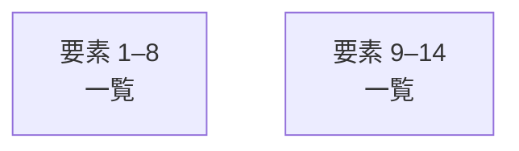

# overall-architecture/group-1/n-docs-71ab8b

[解析トップへ戻る](../../../README.md)

確認したパス: `docs`。配下の登録ファイルは2373件。

- `docs/ASTRA_UIUX_TEST_SPEC_v1.0.md`（一覧のみ）
- `docs/ASTRA_UX_PRINCIPLES.md`（一覧のみ）
- `docs/COMPUTER_USE.md`（一覧のみ）
- `docs/COMPUTER_VISION.md`（一覧のみ）
- `docs/CONNECTIONS.md`（一覧のみ）
- `docs/CONSUMER_JOURNEYS.md`（一覧のみ）
- `docs/DESIGN_SYSTEM.md`（一覧のみ）
- `docs/ENTERPRISE_READINESS.md`（一覧のみ）
- `docs/FIRST_RUN.md`（一覧のみ）
- `docs/GENIE_RENAME.md`（一覧のみ）
- `docs/LOCAL_PREVIEW.ja.md`（一覧のみ）
- `docs/LOCAL_PREVIEW.md`（一覧のみ）
- `docs/MANAGED_PREVIEW.ja.md`（一覧のみ）
- `docs/MANAGED_PREVIEW.md`（一覧のみ）
- `docs/README.ja.md`（一覧のみ）
- `docs/README.md`（一覧のみ）
- `docs/TESTING.ja.md`（一覧のみ）
- `docs/TESTING.md`（一覧のみ）
- `docs/adr/0001-modular-monolith-deployment.md`（一覧のみ）
- `docs/adr/0002-sql-first-schema.md`（一覧のみ）
- `docs/adr/0003-sse-for-server-streams.md`（一覧のみ）
- `docs/adr/0004-fastify-as-the-http-layer.md`（一覧のみ）
- `docs/adr/README.md`（一覧のみ）
- `docs/closing-remaining-conditions.md`（一覧のみ）
- `docs/content/zenn/RESEARCH.md`（一覧のみ）
- `docs/content/zenn/genie-mac-workspace.md`（一覧のみ）
- `docs/content/zenn/publication.json`（一覧のみ）
- `docs/deepnote-audio-stt-migration.md`（一覧のみ）
- `docs/evidence/api-cost-audit/RESULTS.md`（一覧のみ）
- `docs/evidence/cloud-transcription/README.md`（一覧のみ）
- `docs/evidence/cloud-transcription/long-japanese.json`（一覧のみ）
- `docs/evidence/cloud-transcription/short-japanese.json`（一覧のみ）
- `docs/evidence/codex-cli.md`（一覧のみ）
- `docs/evidence/connections-completion/RESULTS.md`（一覧のみ）
- `docs/evidence/connectors-and-host.md`（一覧のみ）

## 要素の説明

### group-1

このグループは表示用の区切りです。独立した実行モジュールではありません。

[詳細な図と説明を見る](group-1/README.md)

### group-2

このグループは表示用の区切りです。独立した実行モジュールではありません。

[詳細な図と説明を見る](group-2/README.md)

