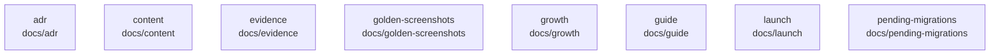

# overall-architecture/group-1/n-docs-71ab8b/group-1

[解析トップへ戻る](../../../../README.md)

このグループは表示用の区切りです。独立した実行モジュールではありません。

## 要素の説明

### n-docs-adr-aa1f87

実在パス: `docs/adr`。5ファイル。

- `docs/adr/0001-modular-monolith-deployment.md`
- `docs/adr/0002-sql-first-schema.md`
- `docs/adr/0003-sse-for-server-streams.md`
- `docs/adr/0004-fastify-as-the-http-layer.md`
- `docs/adr/README.md`

### n-docs-content-625b63

実在パス: `docs/content`。3ファイル。

- `docs/content/zenn/RESEARCH.md`
- `docs/content/zenn/genie-mac-workspace.md`
- `docs/content/zenn/publication.json`

### n-docs-evidence-3d7bf7

実在パス: `docs/evidence`。153ファイル。

- `docs/evidence/api-cost-audit/RESULTS.md`
- `docs/evidence/cloud-transcription/README.md`
- `docs/evidence/cloud-transcription/long-japanese.json`
- `docs/evidence/cloud-transcription/short-japanese.json`
- `docs/evidence/codex-cli.md`
- `docs/evidence/connections-completion/RESULTS.md`
- `docs/evidence/connectors-and-host.md`
- `docs/evidence/consumer-journeys/RESULTS.md`
- `docs/evidence/consumer-journeys/itinerary-fixture.md`
- `docs/evidence/density-baseline.json`
- `docs/evidence/final-e2e.md`
- `docs/evidence/language-model-byok.md`
- `docs/evidence/live-translation/RESULTS.md`
- `docs/evidence/live-translation/llama3.2-comparison.json`
- `docs/evidence/live-translation/quality.json`
- `docs/evidence/live-translation/result.json`
- `docs/evidence/live-translation/validation-summary.txt`
- `docs/evidence/managed-local-preview.md`
- `docs/evidence/oauth.md`
- `docs/evidence/outcome-workspace/RESULTS.md`
- `docs/evidence/outcome-workspace/announcement-result.md`
- `docs/evidence/outcome-workspace/geometry-check.log`
- `docs/evidence/outcome-workspace/host-tests.log`
- `docs/evidence/outcome-workspace/live7.log`
- `docs/evidence/outcome-workspace/local-model-draft.md`

### n-docs-golden-screenshots-d25c62

実在パス: `docs/golden-screenshots`。486ファイル。

- `docs/golden-screenshots/01-voice-hud-idle.png`
- `docs/golden-screenshots/02-voice-hud-listening.png`
- `docs/golden-screenshots/02b-voice-hud-preparing.png`
- `docs/golden-screenshots/03-recording-workspace.png`
- `docs/golden-screenshots/03b-recording-paused.png`
- `docs/golden-screenshots/04-recording-transcript.png`
- `docs/golden-screenshots/05-recording-rag.png`
- `docs/golden-screenshots/06-main-home.png`
- `docs/golden-screenshots/07-apps.png`
- `docs/golden-screenshots/08-meeting-detail.png`
- `docs/golden-screenshots/09-permission-denied.png`
- `docs/golden-screenshots/09b-stt-unavailable.png`
- `docs/golden-screenshots/10-agent-timeline.png`
- `docs/golden-screenshots/11-meeting-canvas.png`
- `docs/golden-screenshots/12-recording-now.png`
- `docs/golden-screenshots/cloud-transcription/geometry.json`
- `docs/golden-screenshots/cloud-transcription/retry-dark.png`
- `docs/golden-screenshots/cloud-transcription/retry-light.png`
- `docs/golden-screenshots/cloud-transcription/settings-dark.png`
- `docs/golden-screenshots/cloud-transcription/settings-light.png`
- `docs/golden-screenshots/connections-completion/connections-1162-dark.png`
- `docs/golden-screenshots/connections-completion/connections-1162-light.png`
- `docs/golden-screenshots/connections-completion/connections-940-dark.png`
- `docs/golden-screenshots/connections-completion/connections-940-light.png`
- `docs/golden-screenshots/connections-completion/geometry.json`

### n-docs-growth-1b4a54

実在パス: `docs/growth`。2ファイル。

- `docs/growth/2026-09-14/README.md`
- `docs/growth/2026-09-14/metrics.json`

### n-docs-guide-00049a

実在パス: `docs/guide`。5ファイル。

- `docs/guide/Astra-操作ガイド.pdf`
- `docs/guide/FACTS.md`
- `docs/guide/Genie-guide-ja.pdf`
- `docs/guide/build-genie-pdf.py`
- `docs/guide/build.py`

### n-docs-launch-5a3e7e

実在パス: `docs/launch`。44ファイル。

- `docs/launch/2026-09-12/DEMO-ANSWER.md`
- `docs/launch/2026-09-12/SOCIAL.md`
- `docs/launch/2026-09-12/STRATEGY.md`
- `docs/launch/2026-09-12/VALIDATION.json`
- `docs/launch/2026-09-12/VIDEO.md`
- `docs/launch/2026-09-12/v2/PROPOSAL.md`
- `docs/launch/2026-09-12/v2/PUBLICATION.md`
- `docs/launch/2026-09-12/v2/RESEARCH.md`
- `docs/launch/2026-09-12/v2/media-validation.json`
- `docs/launch/2026-09-12/v2/mobile-review.png`
- `docs/launch/2026-09-12/v2/poster.jpg`
- `docs/launch/2026-09-12/v2/proposal-en.vtt`
- `docs/launch/2026-09-12/v2/proposal-ja.vtt`
- `docs/launch/2026-09-12/v2/provenance.json`
- `docs/launch/2026-09-12/v2/wide-review.png`
- `docs/launch/2026-09-12/v3/PROMPT.txt`
- `docs/launch/2026-09-12/v3/PROVENANCE.md`
- `docs/launch/2026-09-12/v3/PUBLICATION.md`
- `docs/launch/2026-09-12/v3/RESEARCH.md`
- `docs/launch/2026-09-12/v3/media-validation.json`
- `docs/launch/2026-09-12/v3/orbit-codex.html`
- `docs/launch/2026-09-12/v3/orbit-en.srt`
- `docs/launch/2026-09-12/v3/orbit-en.vtt`
- `docs/launch/2026-09-12/v3/orbit-from-astra.md`
- `docs/launch/2026-09-12/v3/orbit-ja.srt`

### n-docs-pending-migrations-dfcdd2

実在パス: `docs/pending-migrations`。1ファイル。

- `docs/pending-migrations/20260829010000_world_embeddings.sql`

