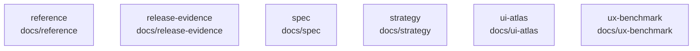

# overall-architecture/group-1/n-docs-71ab8b/group-2

[解析トップへ戻る](../../../../README.md)

このグループは表示用の区切りです。独立した実行モジュールではありません。

## 要素の説明

### n-docs-reference-41fc69

実在パス: `docs/reference`。1ファイル。

- `docs/reference/README.md`

### n-docs-release-evidence-26acd6

実在パス: `docs/release-evidence`。30ファイル。

- `docs/release-evidence/2026-09-08/ui-taste-review.json`
- `docs/release-evidence/2026-09-08/ui-taste-review.md`
- `docs/release-evidence/2026-09-09/initial-profile.md`
- `docs/release-evidence/2026-09-09/live-service-validation.md`
- `docs/release-evidence/2026-09-10/gateway-smoke.json`
- `docs/release-evidence/2026-09-10/gateway-smoke.md`
- `docs/release-evidence/2026-09-10/normal-launch.md`
- `docs/release-evidence/2026-09-10/recording-keyboard.md`
- `docs/release-evidence/2026-09-10/review-fixes.md`
- `docs/release-evidence/2026-09-13-genie/journeys/JA/01-home.png`
- `docs/release-evidence/2026-09-13-genie/journeys/JA/03-running.png`
- `docs/release-evidence/2026-09-13-genie/journeys/JA/result.json`
- `docs/release-evidence/2026-09-13-genie/journeys/JB-motion/result.json`
- `docs/release-evidence/2026-09-13-genie/journeys/JB/01-meeting.png`
- `docs/release-evidence/2026-09-13-genie/journeys/JB/02-notes.png`
- `docs/release-evidence/2026-09-13-genie/journeys/JB/03-workspace.png`
- `docs/release-evidence/2026-09-13-genie/journeys/JB/04-ended.png`
- `docs/release-evidence/2026-09-13-genie/journeys/JB/05-library.png`
- `docs/release-evidence/2026-09-13-genie/journeys/JB/06-source.png`
- `docs/release-evidence/2026-09-13-genie/journeys/JB/07-reopened.png`
- `docs/release-evidence/2026-09-13-genie/journeys/JB/result.json`
- `docs/release-evidence/2026-09-13-genie/journeys/JC/01-denied.png`
- `docs/release-evidence/2026-09-13-genie/journeys/JC/02-recovered.png`
- `docs/release-evidence/2026-09-13-genie/journeys/JC/03-after-sharing.png`
- `docs/release-evidence/2026-09-13-genie/journeys/JC/04-confirm.png`

### n-docs-spec-8eacaa

実在パス: `docs/spec`。11ファイル。

- `docs/spec/astra_ui_ux_concept.png`
- `docs/spec/astra_ui_ux_detailed_spec_v0.1.docx`
- `docs/spec/astra_ui_ux_detailed_spec_v0.1.md`
- `docs/spec/new_ai_platform_design_spec_v0.1.md`
- `docs/spec/phase-0-implementation-spec.md`
- `docs/spec/phase-2-implementation-spec.md`
- `docs/spec/phase-3-implementation-spec.md`
- `docs/spec/phase-4-implementation-spec.md`
- `docs/spec/phase-5-implementation-spec.md`
- `docs/spec/phase-6-implementation-spec.md`
- `docs/spec/phase-7-implementation-spec.md`

### n-docs-strategy-d9f6f5

実在パス: `docs/strategy`。2ファイル。

- `docs/strategy/first-video-brief.md`
- `docs/strategy/outcome-execution.md`

### n-docs-ui-atlas-6005d8

実在パス: `docs/ui-atlas`。901ファイル。

- `docs/ui-atlas/Astra-UI-Atlas.pdf`
- `docs/ui-atlas/PIXEL-REGRESSION-85b8333.md`
- `docs/ui-atlas/README.md`
- `docs/ui-atlas/REVIEW-2026-09-05-pixel.md`
- `docs/ui-atlas/VISUAL_SUPREMACY_REPORT.md`
- `docs/ui-atlas/contact-sheet.png`
- `docs/ui-atlas/dock-dark/01-idle.png`
- `docs/ui-atlas/dock-dark/01b-quick-actions.png`
- `docs/ui-atlas/dock-dark/02-app-context.png`
- `docs/ui-atlas/dock-dark/03-app-context-expanded.png`
- `docs/ui-atlas/dock-dark/04-listening.png`
- `docs/ui-atlas/dock-dark/05-thinking.png`
- `docs/ui-atlas/dock-dark/06-agent.png`
- `docs/ui-atlas/dock-dark/06b-context-detail.png`
- `docs/ui-atlas/dock-dark/06c-result.png`
- `docs/ui-atlas/dock-dark/06d-result-failed.png`
- `docs/ui-atlas/dock-dark/07-confirmation.png`
- `docs/ui-atlas/dock-dark/07b-confirmation-edit.png`
- `docs/ui-atlas/dock-dark/08-meeting.png`
- `docs/ui-atlas/dock-dark/08a-meeting-preparing.png`
- `docs/ui-atlas/dock-dark/08b-meeting-paused.png`
- `docs/ui-atlas/dock-dark/09-meeting-notes.png`
- `docs/ui-atlas/dock-dark/09b-meeting-captions.png`
- `docs/ui-atlas/dock-dark/09c-meeting-ask.png`
- `docs/ui-atlas/dock-dark/10-workspace.png`

### n-docs-ux-benchmark-5df57b

実在パス: `docs/ux-benchmark`。695ファイル。

- `docs/ux-benchmark/CLAIMS.md`
- `docs/ux-benchmark/COMPETITIVE_DESIGN.md`
- `docs/ux-benchmark/DESIGN_SCORECARD.md`
- `docs/ux-benchmark/EVIDENCE.md`
- `docs/ux-benchmark/PUBLIC_SOURCES.md`
- `docs/ux-benchmark/RC-SESSION-RUNBOOK.md`
- `docs/ux-benchmark/README.md`
- `docs/ux-benchmark/REALITY_GATES.md`
- `docs/ux-benchmark/a11y/2026-09-04-a11ynames-4tab.tsv`
- `docs/ux-benchmark/a11y/2026-09-04-a11ynames.tsv`
- `docs/ux-benchmark/a11y/README.md`
- `docs/ux-benchmark/a11y/RUNBOOK.md`
- `docs/ux-benchmark/astra/J01/result.json`
- `docs/ux-benchmark/astra/J02/result.json`
- `docs/ux-benchmark/astra/J03/result.json`
- `docs/ux-benchmark/astra/J04/01-detected.png`
- `docs/ux-benchmark/astra/J04/02-recording.png`
- `docs/ux-benchmark/astra/J04/result.json`
- `docs/ux-benchmark/astra/J05/01-start.png`
- `docs/ux-benchmark/astra/J05/02-notes.png`
- `docs/ux-benchmark/astra/J05/result.json`
- `docs/ux-benchmark/astra/J06/result.json`
- `docs/ux-benchmark/astra/J07/result.json`
- `docs/ux-benchmark/astra/J08/result.json`
- `docs/ux-benchmark/astra/J09/01-拾ったあと.png`

