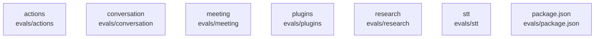

# overall-architecture/group-1/n-evals-64bacb

[解析トップへ戻る](../../../README.md)

確認したパス: `evals`。配下の登録ファイルは51件。

- `evals/README.md`（一覧のみ）
- `evals/actions/agent-host/acceptance.test.ts`（一覧のみ）
- `evals/actions/agent-host/meta.yaml`（一覧のみ）
- `evals/actions/care/acceptance.test.ts`（一覧のみ）
- `evals/actions/care/meta.yaml`（一覧のみ）
- `evals/actions/connectors/acceptance.test.ts`（一覧のみ）
- `evals/actions/connectors/bridge.test.ts`（一覧のみ）
- `evals/actions/connectors/meta.yaml`（一覧のみ）
- `evals/actions/connectors/oauth-e2e.test.ts`（一覧のみ）
- `evals/actions/connectors/tool-coverage.test.ts`（一覧のみ）
- `evals/actions/conversation/long.test.ts`（一覧のみ）
- `evals/actions/conversation/meta.yaml`（一覧のみ）
- `evals/actions/domain-agents/acceptance.test.ts`（一覧のみ）
- `evals/actions/domain-agents/meta.yaml`（一覧のみ）
- `evals/actions/ehr/acceptance.test.ts`（一覧のみ）
- `evals/actions/ehr/meta.yaml`（一覧のみ）
- `evals/actions/final/approval-expiry.test.ts`（一覧のみ）
- `evals/actions/final/background-work.test.ts`（一覧のみ）
- `evals/actions/final/calendar-gmail-chain.test.ts`（一覧のみ）
- `evals/actions/final/chaos.test.ts`（一覧のみ）
- `evals/actions/final/e2e.test.ts`（一覧のみ）
- `evals/actions/final/meta.yaml`（一覧のみ）
- `evals/actions/phase0/acceptance.test.ts`（一覧のみ）
- `evals/actions/phase0/meta.yaml`（一覧のみ）
- `evals/actions/phase2/acceptance.test.ts`（一覧のみ）
- `evals/actions/phase2/meta.yaml`（一覧のみ）
- `evals/actions/phase3/acceptance.test.ts`（一覧のみ）
- `evals/actions/phase3/meta.yaml`（一覧のみ）
- `evals/actions/phase4/acceptance.test.ts`（一覧のみ）
- `evals/actions/phase4/meta.yaml`（一覧のみ）
- `evals/actions/phase5/acceptance.test.ts`（一覧のみ）
- `evals/actions/phase5/meta.yaml`（一覧のみ）
- `evals/actions/phase6/acceptance.test.ts`（一覧のみ）
- `evals/actions/phase6/meta.yaml`（一覧のみ）
- `evals/actions/phase7/acceptance.test.ts`（一覧のみ）

## 要素の説明

### n-evals-actions-ae1454

実在パス: `evals/actions`。44ファイル。

- `evals/actions/agent-host/acceptance.test.ts`
- `evals/actions/agent-host/meta.yaml`
- `evals/actions/care/acceptance.test.ts`
- `evals/actions/care/meta.yaml`
- `evals/actions/connectors/acceptance.test.ts`
- `evals/actions/connectors/bridge.test.ts`
- `evals/actions/connectors/meta.yaml`
- `evals/actions/connectors/oauth-e2e.test.ts`
- `evals/actions/connectors/tool-coverage.test.ts`
- `evals/actions/conversation/long.test.ts`
- `evals/actions/conversation/meta.yaml`
- `evals/actions/domain-agents/acceptance.test.ts`
- `evals/actions/domain-agents/meta.yaml`
- `evals/actions/ehr/acceptance.test.ts`
- `evals/actions/ehr/meta.yaml`
- `evals/actions/final/approval-expiry.test.ts`
- `evals/actions/final/background-work.test.ts`
- `evals/actions/final/calendar-gmail-chain.test.ts`
- `evals/actions/final/chaos.test.ts`
- `evals/actions/final/e2e.test.ts`
- `evals/actions/final/meta.yaml`
- `evals/actions/phase0/acceptance.test.ts`
- `evals/actions/phase0/meta.yaml`
- `evals/actions/phase2/acceptance.test.ts`
- `evals/actions/phase2/meta.yaml`

### n-evals-conversation-5d09f1

実在パス: `evals/conversation`。1ファイル。

- `evals/conversation/README.md`

### n-evals-meeting-50a861

実在パス: `evals/meeting`。1ファイル。

- `evals/meeting/README.md`

### n-evals-package-json-f66ddc

実在パス: `evals/package.json`。1ファイル。

- `evals/package.json`

### n-evals-plugins-f80f71

実在パス: `evals/plugins`。1ファイル。

- `evals/plugins/README.md`

### n-evals-research-78de78

実在パス: `evals/research`。1ファイル。

- `evals/research/README.md`

### n-evals-stt-05d3db

実在パス: `evals/stt`。1ファイル。

- `evals/stt/README.md`

