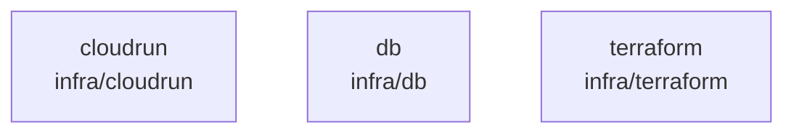

# overall-architecture/group-1/n-infra-5e03a5

[解析トップへ戻る](../../../README.md)

確認したパス: `infra`。配下の登録ファイルは38件。

- `infra/cloudrun/README.md`（一覧のみ）
- `infra/db/README.md`（一覧のみ）
- `infra/db/bootstrap.sql`（一覧のみ）
- `infra/db/migrations/20260826010001_extensions.sql`（一覧のみ）
- `infra/db/migrations/20260826010002_identity.sql`（一覧のみ）
- `infra/db/migrations/20260826010003_conversations.sql`（一覧のみ）
- `infra/db/migrations/20260826010004_tasks.sql`（一覧のみ）
- `infra/db/migrations/20260826010005_library.sql`（一覧のみ）
- `infra/db/migrations/20260826010006_plugins.sql`（一覧のみ）
- `infra/db/migrations/20260826010007_audit.sql`（一覧のみ）
- `infra/db/migrations/20260826010008_rls.sql`（一覧のみ）
- `infra/db/migrations/20260826020001_shares.sql`（一覧のみ）
- `infra/db/migrations/20260826020002_research.sql`（一覧のみ）
- `infra/db/migrations/20260826030001_meetings.sql`（一覧のみ）
- `infra/db/migrations/20260826040001_plugin_assets.sql`（一覧のみ）
- `infra/db/migrations/20260826050001_agent_packages.sql`（一覧のみ）
- `infra/db/migrations/20260826060001_world_model.sql`（一覧のみ）
- `infra/db/migrations/20260827010001_conversation_state.sql`（一覧のみ）
- `infra/db/migrations/20260827020001_onboarding.sql`（一覧のみ）
- `infra/db/migrations/20260827030001_connections.sql`（一覧のみ）
- `infra/db/migrations/20260827040001_workflow_assets.sql`（一覧のみ）
- `infra/db/migrations/20260827050001_receipt_step.sql`（一覧のみ）
- `infra/db/migrations/20260827060001_attention_feedback.sql`（一覧のみ）
- `infra/db/migrations/20260827070001_agent_hosts.sql`（一覧のみ）
- `infra/db/migrations/20260827090000_host_step_requests.sql`（一覧のみ）
- `infra/db/migrations/20260827093000_host_step_request_key.sql`（一覧のみ）
- `infra/db/migrations/20260827103000_meeting_segment_source.sql`（一覧のみ）
- `infra/db/migrations/20260827120000_evidence_provenance.sql`（一覧のみ）
- `infra/db/migrations/20260827150000_user_identities.sql`（一覧のみ）
- `infra/db/migrations/20260907090000_work_context.sql`（一覧のみ）
- `infra/db/migrations/20260907170000_work_sync_cursor.sql`（一覧のみ）
- `infra/db/migrations/20260909120000_initial_profiles.sql`（一覧のみ）
- `infra/db/migrations/20260910003000_initial_profile_snapshot.sql`（一覧のみ）
- `infra/db/schema.sql`（一覧のみ）
- `infra/db/verify.sh`（一覧のみ）

## 要素の説明

### n-infra-cloudrun-c4b950

実在パス: `infra/cloudrun`。1ファイル。

- `infra/cloudrun/README.md`

### n-infra-db-525ffb

実在パス: `infra/db`。35ファイル。

- `infra/db/README.md`
- `infra/db/bootstrap.sql`
- `infra/db/migrations/20260826010001_extensions.sql`
- `infra/db/migrations/20260826010002_identity.sql`
- `infra/db/migrations/20260826010003_conversations.sql`
- `infra/db/migrations/20260826010004_tasks.sql`
- `infra/db/migrations/20260826010005_library.sql`
- `infra/db/migrations/20260826010006_plugins.sql`
- `infra/db/migrations/20260826010007_audit.sql`
- `infra/db/migrations/20260826010008_rls.sql`
- `infra/db/migrations/20260826020001_shares.sql`
- `infra/db/migrations/20260826020002_research.sql`
- `infra/db/migrations/20260826030001_meetings.sql`
- `infra/db/migrations/20260826040001_plugin_assets.sql`
- `infra/db/migrations/20260826050001_agent_packages.sql`
- `infra/db/migrations/20260826060001_world_model.sql`
- `infra/db/migrations/20260827010001_conversation_state.sql`
- `infra/db/migrations/20260827020001_onboarding.sql`
- `infra/db/migrations/20260827030001_connections.sql`
- `infra/db/migrations/20260827040001_workflow_assets.sql`
- `infra/db/migrations/20260827050001_receipt_step.sql`
- `infra/db/migrations/20260827060001_attention_feedback.sql`
- `infra/db/migrations/20260827070001_agent_hosts.sql`
- `infra/db/migrations/20260827090000_host_step_requests.sql`
- `infra/db/migrations/20260827093000_host_step_request_key.sql`

### n-infra-terraform-7b0663

実在パス: `infra/terraform`。1ファイル。

- `infra/terraform/README.md`

