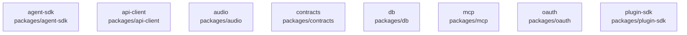

# overall-architecture/group-1/n-packages-d8ae08/group-1

[解析トップへ戻る](../../../../README.md)

このグループは表示用の区切りです。独立した実行モジュールではありません。

## 要素の説明

### n-packages-agent-sdk-d6327d

実在パス: `packages/agent-sdk`。5ファイル。

- `packages/agent-sdk/package.json`
- `packages/agent-sdk/src/author.ts`
- `packages/agent-sdk/src/index.ts`
- `packages/agent-sdk/test/author.test.ts`
- `packages/agent-sdk/tsconfig.json`

### n-packages-api-client-bf71d3

実在パス: `packages/api-client`。9ファイル。

- `packages/api-client/package.json`
- `packages/api-client/src/client.ts`
- `packages/api-client/src/errors.ts`
- `packages/api-client/src/http.ts`
- `packages/api-client/src/index.ts`
- `packages/api-client/src/share.ts`
- `packages/api-client/src/sse.ts`
- `packages/api-client/test/client.test.ts`
- `packages/api-client/tsconfig.json`

### n-packages-audio-14c91c

実在パス: `packages/audio`。7ファイル。

- `packages/audio/package.json`
- `packages/audio/src/capture.ts`
- `packages/audio/src/frame.ts`
- `packages/audio/src/index.ts`
- `packages/audio/src/mix.ts`
- `packages/audio/test/frame.test.ts`
- `packages/audio/tsconfig.json`

### n-packages-contracts-de2336

実在パス: `packages/contracts`。59ファイル。

- `packages/contracts/package.json`
- `packages/contracts/src/agent-host.ts`
- `packages/contracts/src/api.ts`
- `packages/contracts/src/approval.ts`
- `packages/contracts/src/artifact.ts`
- `packages/contracts/src/canonical.ts`
- `packages/contracts/src/codec.ts`
- `packages/contracts/src/context.ts`
- `packages/contracts/src/conversation.ts`
- `packages/contracts/src/dashboard.ts`
- `packages/contracts/src/domain.ts`
- `packages/contracts/src/errors.ts`
- `packages/contracts/src/escalation.ts`
- `packages/contracts/src/events.ts`
- `packages/contracts/src/evidence.ts`
- `packages/contracts/src/host.ts`
- `packages/contracts/src/identity.ts`
- `packages/contracts/src/ids.ts`
- `packages/contracts/src/index.ts`
- `packages/contracts/src/language-model.ts`
- `packages/contracts/src/mcp.ts`
- `packages/contracts/src/meeting.ts`
- `packages/contracts/src/onboarding.ts`
- `packages/contracts/src/plugin.ts`
- `packages/contracts/src/policy-doc.ts`

### n-packages-db-389fab

実在パス: `packages/db`。9ファイル。

- `packages/db/package.json`
- `packages/db/src/config.ts`
- `packages/db/src/generated/schema.ts`
- `packages/db/src/index.ts`
- `packages/db/src/pool.ts`
- `packages/db/src/tenant.ts`
- `packages/db/src/types.ts`
- `packages/db/test/scopes.integration.test.ts`
- `packages/db/tsconfig.json`

### n-packages-mcp-027ee0

実在パス: `packages/mcp`。9ファイル。

- `packages/mcp/package.json`
- `packages/mcp/src/client.ts`
- `packages/mcp/src/index.ts`
- `packages/mcp/src/protocol.ts`
- `packages/mcp/src/transport.ts`
- `packages/mcp/test/client.test.ts`
- `packages/mcp/test/fixtures/echo-server.mjs`
- `packages/mcp/test/transport.test.ts`
- `packages/mcp/tsconfig.json`

### n-packages-oauth-79c084

実在パス: `packages/oauth`。9ファイル。

- `packages/oauth/package.json`
- `packages/oauth/src/flow.ts`
- `packages/oauth/src/index.ts`
- `packages/oauth/src/pkce.ts`
- `packages/oauth/src/providers.ts`
- `packages/oauth/src/store.ts`
- `packages/oauth/test/flow.test.ts`
- `packages/oauth/test/providers.test.ts`
- `packages/oauth/tsconfig.json`

### n-packages-plugin-sdk-7c2209

実在パス: `packages/plugin-sdk`。7ファイル。

- `packages/plugin-sdk/package.json`
- `packages/plugin-sdk/src/assets.ts`
- `packages/plugin-sdk/src/index.ts`
- `packages/plugin-sdk/src/manifest.ts`
- `packages/plugin-sdk/src/signature.ts`
- `packages/plugin-sdk/test/manifest.test.ts`
- `packages/plugin-sdk/tsconfig.json`

