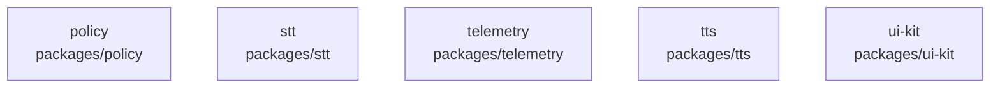

# overall-architecture/group-1/n-packages-d8ae08/group-2

[解析トップへ戻る](../../../../README.md)

このグループは表示用の区切りです。独立した実行モジュールではありません。

## 要素の説明

### n-packages-policy-413b78

実在パス: `packages/policy`。6ファイル。

- `packages/policy/package.json`
- `packages/policy/src/index.ts`
- `packages/policy/src/risk.ts`
- `packages/policy/test/documents.test.ts`
- `packages/policy/test/risk.test.ts`
- `packages/policy/tsconfig.json`

### n-packages-stt-cb6a2a

実在パス: `packages/stt`。9ファイル。

- `packages/stt/package.json`
- `packages/stt/src/dictation.ts`
- `packages/stt/src/index.ts`
- `packages/stt/src/measurement.ts`
- `packages/stt/src/provider.ts`
- `packages/stt/src/vad.ts`
- `packages/stt/test/measurement.test.ts`
- `packages/stt/test/stt.test.ts`
- `packages/stt/tsconfig.json`

### n-packages-telemetry-88cac3

実在パス: `packages/telemetry`。10ファイル。

- `packages/telemetry/package.json`
- `packages/telemetry/src/audit.ts`
- `packages/telemetry/src/db.ts`
- `packages/telemetry/src/index.ts`
- `packages/telemetry/src/logger.ts`
- `packages/telemetry/src/tracing.ts`
- `packages/telemetry/test/audit.integration.test.ts`
- `packages/telemetry/test/audit.test.ts`
- `packages/telemetry/test/logger.test.ts`
- `packages/telemetry/tsconfig.json`

### n-packages-tts-05c7b7

実在パス: `packages/tts`。6ファイル。

- `packages/tts/package.json`
- `packages/tts/src/index.ts`
- `packages/tts/src/measurement.ts`
- `packages/tts/src/provider.ts`
- `packages/tts/test/provider.test.ts`
- `packages/tts/tsconfig.json`

### n-packages-ui-kit-761106

実在パス: `packages/ui-kit`。17ファイル。

- `packages/ui-kit/package.json`
- `packages/ui-kit/src/contrast.ts`
- `packages/ui-kit/src/index.ts`
- `packages/ui-kit/src/navigation.ts`
- `packages/ui-kit/src/shortcuts.ts`
- `packages/ui-kit/src/theme.ts`
- `packages/ui-kit/src/tokens/color.ts`
- `packages/ui-kit/src/tokens/css.ts`
- `packages/ui-kit/src/tokens/dock.ts`
- `packages/ui-kit/src/tokens/layout.ts`
- `packages/ui-kit/src/tokens/motion.ts`
- `packages/ui-kit/src/tokens/space.ts`
- `packages/ui-kit/src/tokens/typography.ts`
- `packages/ui-kit/test/css-vars.test.ts`
- `packages/ui-kit/test/shortcuts.test.ts`
- `packages/ui-kit/test/tokens.test.ts`
- `packages/ui-kit/tsconfig.json`

