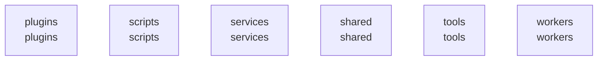

# overall-architecture/group-2

[解析トップへ戻る](../../README.md)

このグループは表示用の区切りです。独立した実行モジュールではありません。

## 要素の説明

### n-plugins-440c33

確認したパス: `plugins`。配下の登録ファイルは52件。

- `plugins/README.md`（一覧のみ）
- `plugins/builtin/architecture/dashboards/project.json`（一覧のみ）
- `plugins/builtin/architecture/plugin.yaml`（一覧のみ）
- `plugins/builtin/architecture/policies/architecture.yaml`（一覧のみ）
- `plugins/builtin/architecture/schemas/entities.json`（一覧のみ）
- `plugins/builtin/architecture/skills/coordinator.md`（一覧のみ）
- `plugins/builtin/calendar/plugin.yaml`（一覧のみ）
- `plugins/builtin/care/dashboards/shift.json`（一覧のみ）
- `plugins/builtin/care/plugin.yaml`（一覧のみ）
- `plugins/builtin/care/policies/care.yaml`（一覧のみ）
- `plugins/builtin/care/schemas/entities.json`（一覧のみ）
- `plugins/builtin/care/skills/assistant.md`（一覧のみ）
- `plugins/builtin/ehr/dashboards/encounters.json`（一覧のみ）
- `plugins/builtin/ehr/plugin.yaml`（一覧のみ）
- `plugins/builtin/ehr/policies/ehr.yaml`（一覧のみ）
- `plugins/builtin/ehr/schemas/entities.json`（一覧のみ）
- `plugins/builtin/ehr/skills/assist.md`（一覧のみ）
- `plugins/builtin/finder/plugin.yaml`（一覧のみ）
- `plugins/builtin/general/plugin.yaml`（一覧のみ）
- `plugins/builtin/general/policies/general.yaml`（一覧のみ）
- `plugins/builtin/general/skills/assistant.md`（一覧のみ）
- `plugins/builtin/general/workflows/assistant.json`（一覧のみ）
- `plugins/builtin/gmail/plugin.yaml`（一覧のみ）
- `plugins/builtin/gmail/skills/mail.md`（一覧のみ）
- `plugins/builtin/gmail/workflows/triage.yaml`（一覧のみ）
- `plugins/builtin/meeting/dashboards/meetings.json`（一覧のみ）
- `plugins/builtin/meeting/plugin.yaml`（一覧のみ）
- `plugins/builtin/meeting/policies/meeting-recording.yaml`（一覧のみ）
- `plugins/builtin/meeting/skills/meeting.md`（一覧のみ）
- `plugins/builtin/microsoft-todo/plugin.yaml`（一覧のみ）
- `plugins/builtin/outlook/plugin.yaml`（一覧のみ）
- `plugins/builtin/research/dashboards/research-runs.json`（一覧のみ）
- `plugins/builtin/research/plugin.yaml`（一覧のみ）
- `plugins/builtin/research/policies/research-sources.yaml`（一覧のみ）
- `plugins/builtin/research/skills/research.md`（一覧のみ）

### n-scripts-16728d

確認したパス: `scripts`。配下の登録ファイルは122件。

- `scripts/build-computer-helper.sh`（一覧のみ）
- `scripts/build-dmg.sh`（一覧のみ）
- `scripts/build-macos-app.sh`（一覧のみ）
- `scripts/check-cabi-csharp.mjs`（一覧のみ）
- `scripts/check-contracts-version.mjs`（一覧のみ）
- `scripts/check-conventions.mjs`（一覧のみ）
- `scripts/check-generated.sh`（一覧のみ）
- `scripts/check-native-tauri-free.mjs`（一覧のみ）
- `scripts/check-xaml-wellformed.sh`（一覧のみ）
- `scripts/doctor-local-preview.mjs`（一覧のみ）
- `scripts/dump-schema.sh`（一覧のみ）
- `scripts/fetch-sparkle.sh`（一覧のみ）
- `scripts/finish-oauth.sh`（一覧のみ）
- `scripts/gates.sh`（一覧のみ）
- `scripts/gen-crm-entities.mjs`（一覧のみ）
- `scripts/gen-design-tokens.mjs`（一覧のみ）
- `scripts/gen-dock-geometry.mjs`（一覧のみ）
- `scripts/gen-liquid-orb.mjs`（一覧のみ）
- `scripts/gen-shortcuts.mjs`（一覧のみ）
- `scripts/gen-swift-bindings.sh`（一覧のみ）
- `scripts/gen-workspace-fixture.mjs`（一覧のみ）
- `scripts/ideal-release-gate.sh`（一覧のみ）
- `scripts/install-local-stt.sh`（一覧のみ）
- `scripts/install-native-messaging-host.sh`（一覧のみ）
- `scripts/lint-terms.sh`（一覧のみ）
- `scripts/lint-type-literals.mjs`（一覧のみ）
- `scripts/local-preview/check-worker.mjs`（一覧のみ）
- `scripts/local-preview/child.mjs`（一覧のみ）
- `scripts/local-preview/config.mjs`（一覧のみ）
- `scripts/local-preview/processes.mjs`（一覧のみ）
- `scripts/package-macos-app.sh`（一覧のみ）
- `scripts/prepare-connection-config.mjs`（一覧のみ）
- `scripts/publish-update.sh`（一覧のみ）
- `scripts/qualitative-gate.sh`（一覧のみ）
- `scripts/reality/run-competitors.sh`（一覧のみ）

[詳細な図と説明を見る](n-scripts-16728d/README.md)

### n-services-3e7aaa

確認したパス: `services`。配下の登録ファイルは269件。

- `services/agent-host/package.json`（一覧のみ）
- `services/agent-host/src/bridge.ts`（一覧のみ）
- `services/agent-host/src/index.ts`（内容確認済み）
- `services/agent-host/src/service.ts`（一覧のみ）
- `services/agent-host/src/step-executor.ts`（一覧のみ）
- `services/agent-host/test/bridge.db.test.ts`（一覧のみ）
- `services/agent-host/test/service.db.test.ts`（一覧のみ）
- `services/agent-host/tsconfig.json`（一覧のみ）
- `services/agent-runtime/package.json`（一覧のみ）
- `services/agent-runtime/src/architecture-executor.ts`（一覧のみ）
- `services/agent-runtime/src/architecture.ts`（一覧のみ）
- `services/agent-runtime/src/care-executor.ts`（一覧のみ）
- `services/agent-runtime/src/care.ts`（一覧のみ）
- `services/agent-runtime/src/data-sources.ts`（一覧のみ）
- `services/agent-runtime/src/definitions.ts`（一覧のみ）
- `services/agent-runtime/src/domain.ts`（一覧のみ）
- `services/agent-runtime/src/ehr-executor.ts`（一覧のみ）
- `services/agent-runtime/src/ehr.ts`（一覧のみ）
- `services/agent-runtime/src/image.ts`（一覧のみ）
- `services/agent-runtime/src/imagen.ts`（一覧のみ）
- `services/agent-runtime/src/index.ts`（内容確認済み）
- `services/agent-runtime/src/media-factory.ts`（一覧のみ）
- `services/agent-runtime/src/sales-crm-executor.ts`（一覧のみ）
- `services/agent-runtime/src/sales-crm.ts`（一覧のみ）
- `services/agent-runtime/src/stock-executor.ts`（一覧のみ）
- `services/agent-runtime/src/stock.ts`（一覧のみ）
- `services/agent-runtime/src/video-executor.ts`（一覧のみ）
- `services/agent-runtime/src/video.ts`（一覧のみ）
- `services/agent-runtime/test/architecture.test.ts`（一覧のみ）
- `services/agent-runtime/test/care.test.ts`（一覧のみ）
- `services/agent-runtime/test/domain.db.test.ts`（一覧のみ）
- `services/agent-runtime/test/ehr.test.ts`（一覧のみ）
- `services/agent-runtime/test/image.db.test.ts`（一覧のみ）
- `services/agent-runtime/test/imagen.test.ts`（一覧のみ）
- `services/agent-runtime/test/sales-crm-executor.test.ts`（一覧のみ）

[詳細な図と説明を見る](n-services-3e7aaa/README.md)

### n-shared-d18aac

確認したパス: `shared`。配下の登録ファイルは11件。

- `shared/design/DESIGN.md`（一覧のみ）
- `shared/design/fixtures/recording-workspace.path`（一覧のみ）
- `shared/design/fixtures/recording-workspace.svg`（一覧のみ）
- `shared/design/liquid-orb/LICENSE`（一覧のみ）
- `shared/design/liquid-orb/README.md`（一覧のみ）
- `shared/design/liquid-orb/effect.metal`（一覧のみ）
- `shared/design/liquid-orb/effect.wgsl`（一覧のみ）
- `shared/design/liquid-orb/fallback.png`（一覧のみ）
- `shared/design/liquid-orb/preset.json`（一覧のみ）
- `shared/design/liquid-orb/shader-source.ts`（一覧のみ）
- `shared/design/tokens.json`（一覧のみ）

### n-tools-0284c6

確認したパス: `tools`。配下の登録ファイルは16件。

- `tools/computer-use/genie-computer.swift`（一覧のみ）
- `tools/meet-bot/fixture.json`（一覧のみ）
- `tools/meet-bot/join.mjs`（一覧のみ）
- `tools/meet-bot/judge-meeting.py`（一覧のみ）
- `tools/meet-bot/make-corpus.sh`（一覧のみ）
- `tools/meet-bot/package.json`（一覧のみ）
- `tools/ux-lab/README.md`（一覧のみ）
- `tools/ux-lab/axpress.swift`（一覧のみ）
- `tools/ux-lab/calm.swift`（一覧のみ）
- `tools/ux-lab/clicktest.swift`（一覧のみ）
- `tools/ux-lab/framediff.swift`（一覧のみ）
- `tools/ux-lab/motion.swift`（一覧のみ）
- `tools/ux-lab/ocr.swift`（一覧のみ）
- `tools/ux-lab/rect.swift`（一覧のみ）
- `tools/ux-lab/uxin.swift`（一覧のみ）
- `tools/ux-lab/winrect.swift`（一覧のみ）

[詳細な図と説明を見る](n-tools-0284c6/README.md)

### n-workers-f74e09

確認したパス: `workers`。配下の登録ファイルは80件。

- `workers/agent-host/package.json`（一覧のみ）
- `workers/agent-host/src/api-session.ts`（一覧のみ）
- `workers/agent-host/src/claude-code.ts`（一覧のみ）
- `workers/agent-host/src/cloud.ts`（一覧のみ）
- `workers/agent-host/src/codex.ts`（一覧のみ）
- `workers/agent-host/src/compose-quality.ts`（一覧のみ）
- `workers/agent-host/src/computer-planner.ts`（一覧のみ）
- `workers/agent-host/src/computer-runtime.ts`（一覧のみ）
- `workers/agent-host/src/computer-vision-device.ts`（一覧のみ）
- `workers/agent-host/src/computer-vision-policy.ts`（一覧のみ）
- `workers/agent-host/src/computer-vision-prompts.ts`（一覧のみ）
- `workers/agent-host/src/computer-vision.ts`（一覧のみ）
- `workers/agent-host/src/connection-configuration.ts`（一覧のみ）
- `workers/agent-host/src/connector-steps.ts`（一覧のみ）
- `workers/agent-host/src/grants.ts`（一覧のみ）
- `workers/agent-host/src/host.ts`（一覧のみ）
- `workers/agent-host/src/http-llm.ts`（一覧のみ）
- `workers/agent-host/src/index.ts`（一覧のみ）
- `workers/agent-host/src/initial-profile.ts`（一覧のみ）
- `workers/agent-host/src/instance-lock.ts`（一覧のみ）
- `workers/agent-host/src/keychain.ts`（一覧のみ）
- `workers/agent-host/src/live-assert.ts`（一覧のみ）
- `workers/agent-host/src/live-controls.ts`（一覧のみ）
- `workers/agent-host/src/live-fault-transport.ts`（一覧のみ）
- `workers/agent-host/src/live-fixture.ts`（一覧のみ）
- `workers/agent-host/src/live-initial-profile.ts`（一覧のみ）
- `workers/agent-host/src/live-oauth.ts`（一覧のみ）
- `workers/agent-host/src/live-receipt.ts`（一覧のみ）
- `workers/agent-host/src/live-seed.ts`（一覧のみ）
- `workers/agent-host/src/llm-steps.ts`（一覧のみ）
- `workers/agent-host/src/main.ts`（一覧のみ）
- `workers/agent-host/src/runner.ts`（一覧のみ）
- `workers/agent-host/src/step-loop.ts`（一覧のみ）
- `workers/agent-host/src/step-transport.ts`（一覧のみ）
- `workers/agent-host/src/transport.ts`（一覧のみ）

[詳細な図と説明を見る](n-workers-f74e09/README.md)

