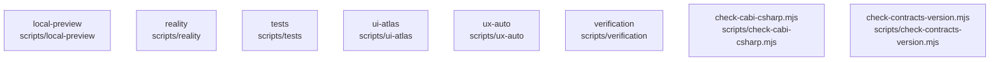

# overall-architecture/group-2/n-scripts-16728d/group-1

[解析トップへ戻る](../../../../README.md)

このグループは表示用の区切りです。独立した実行モジュールではありません。

## 要素の説明

### n-scripts-check-cabi-csharp-mjs-7ad904

実在パス: `scripts/check-cabi-csharp.mjs`。1ファイル。

- `scripts/check-cabi-csharp.mjs`

### n-scripts-check-contracts-version-mjs-57d254

実在パス: `scripts/check-contracts-version.mjs`。1ファイル。

- `scripts/check-contracts-version.mjs`

### n-scripts-local-preview-b3e717

実在パス: `scripts/local-preview`。4ファイル。

- `scripts/local-preview/check-worker.mjs`
- `scripts/local-preview/child.mjs`
- `scripts/local-preview/config.mjs`
- `scripts/local-preview/processes.mjs`

### n-scripts-reality-393d96

実在パス: `scripts/reality`。17ファイル。

- `scripts/reality/run-competitors.sh`
- `scripts/reality/run-daily-work-gate.sh`
- `scripts/reality/run-fka.sh`
- `scripts/reality/run-initial-profile-live.sh`
- `scripts/reality/run-live-tcc.sh`
- `scripts/reality/run-meeting-work-loop-gate.sh`
- `scripts/reality/run-real-meeting.sh`
- `scripts/reality/run-reply-brief-gate.sh`
- `scripts/reality/run-screenshot-e2e.sh`
- `scripts/reality/run-unattended-verify.sh`
- `scripts/reality/run-voiceover.sh`
- `scripts/reality/run-work-context-gate.sh`
- `scripts/reality/run-work-context-live.sh`
- `scripts/reality/run-work-context-release-gate.sh`
- `scripts/reality/stop-test-process.py`
- `scripts/reality/tcc-dialog.sh`
- `scripts/reality/without-test-credentials.py`

### n-scripts-tests-56c638

実在パス: `scripts/tests`。13ファイル。

- `scripts/tests/doctor-local-preview.test.mjs`
- `scripts/tests/local-preview.test.mjs`
- `scripts/tests/managed-local-preview.test.mjs`
- `scripts/tests/test_csharp_gate.py`
- `scripts/tests/test_dump_schema.py`
- `scripts/tests/test_ideal_release_gate.py`
- `scripts/tests/test_live_cleanup.py`
- `scripts/tests/test_live_credential_boundary.py`
- `scripts/tests/test_release_artifact_verdict.py`
- `scripts/tests/test_release_provenance.py`
- `scripts/tests/test_screenshot_gate.py`
- `scripts/tests/test_ui_taste_count.py`
- `scripts/tests/test_work_release_gate.py`

### n-scripts-ui-atlas-9604ef

実在パス: `scripts/ui-atlas`。6ファイル。

- `scripts/ui-atlas/__pycache__/build.cpython-314.pyc`
- `scripts/ui-atlas/build.py`
- `scripts/ui-atlas/capture-rc.sh`
- `scripts/ui-atlas/pixel-regression.py`
- `scripts/ui-atlas/review-blind.sh`
- `scripts/ui-atlas/review-supremacy.sh`

### n-scripts-ux-auto-ad3a6a

実在パス: `scripts/ux-auto`。20ファイル。

- `scripts/ux-auto/a11y.py`
- `scripts/ux-auto/affordance-validity.py`
- `scripts/ux-auto/aggregate.py`
- `scripts/ux-auto/alignment.py`
- `scripts/ux-auto/auto-gate.py`
- `scripts/ux-auto/blind.sh`
- `scripts/ux-auto/build-tools.sh`
- `scripts/ux-auto/calmness.sh`
- `scripts/ux-auto/capture.sh`
- `scripts/ux-auto/guard.sh`
- `scripts/ux-auto/harness-validity.sh`
- `scripts/ux-auto/judge-validity.py`
- `scripts/ux-auto/judge.sh`
- `scripts/ux-auto/make-affordance-fixtures.sh`
- `scripts/ux-auto/make-judge-fixtures.sh`
- `scripts/ux-auto/make-submetric-fixtures.sh`
- `scripts/ux-auto/motion.sh`
- `scripts/ux-auto/occupation.py`
- `scripts/ux-auto/primary.py`
- `scripts/ux-auto/trust-compare.py`

### n-scripts-verification-4d9800

実在パス: `scripts/verification`。2ファイル。

- `scripts/verification/managed-preview-smoke.mjs`
- `scripts/verification/workplace-local-repeat.mts`

