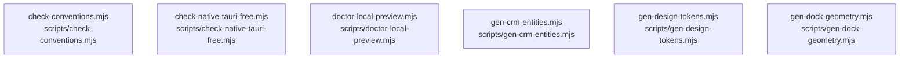

# overall-architecture/group-2/n-scripts-16728d/group-2

[解析トップへ戻る](../../../../README.md)

このグループは表示用の区切りです。独立した実行モジュールではありません。

## 要素の説明

### n-scripts-check-conventions-mjs-974be0

実在パス: `scripts/check-conventions.mjs`。1ファイル。

- `scripts/check-conventions.mjs`

### n-scripts-check-native-tauri-free-mjs-416439

実在パス: `scripts/check-native-tauri-free.mjs`。1ファイル。

- `scripts/check-native-tauri-free.mjs`

### n-scripts-doctor-local-preview-mjs-750f12

実在パス: `scripts/doctor-local-preview.mjs`。1ファイル。

- `scripts/doctor-local-preview.mjs`

### n-scripts-gen-crm-entities-mjs-d84c10

実在パス: `scripts/gen-crm-entities.mjs`。1ファイル。

- `scripts/gen-crm-entities.mjs`

### n-scripts-gen-design-tokens-mjs-d62c10

実在パス: `scripts/gen-design-tokens.mjs`。1ファイル。

- `scripts/gen-design-tokens.mjs`

### n-scripts-gen-dock-geometry-mjs-8dcb0b

実在パス: `scripts/gen-dock-geometry.mjs`。1ファイル。

- `scripts/gen-dock-geometry.mjs`

