# overall-architecture/group-2/n-services-3e7aaa/group-1

[解析トップへ戻る](../../../../README.md)

このグループは表示用の区切りです。独立した実行モジュールではありません。

```mermaid
graph TD
    n-services-agent-host-0b2bcf["agent-host\nservices/agent-host"]
    n-services-agent-runtime-c7d30b["agent-runtime\nservices/agent-runtime"]
    n-services-api-gateway-5d489c["api-gateway\nservices/api-gateway"]
    n-services-capabilities-d3c5d9["capabilities\nservices/capabilities"]
    n-services-connectors-0d6874["connectors\nservices/connectors"]
    n-services-context-ef69b1["context\nservices/context"]
    n-services-conversation-b8f5f1["conversation\nservices/conversation"]
    n-services-library-a35e64["library\nservices/library"]
```

## 要素の説明

### n-services-agent-host-0b2bcf

実在パス: `services/agent-host`。8ファイル。

- `services/agent-host/package.json`
- `services/agent-host/src/bridge.ts`
- `services/agent-host/src/index.ts`
- `services/agent-host/src/service.ts`
- `services/agent-host/src/step-executor.ts`
- `services/agent-host/test/bridge.db.test.ts`
- `services/agent-host/test/service.db.test.ts`
- `services/agent-host/tsconfig.json`

### n-services-agent-runtime-c7d30b

実在パス: `services/agent-runtime`。32ファイル。

- `services/agent-runtime/package.json`
- `services/agent-runtime/src/architecture-executor.ts`
- `services/agent-runtime/src/architecture.ts`
- `services/agent-runtime/src/care-executor.ts`
- `services/agent-runtime/src/care.ts`
- `services/agent-runtime/src/data-sources.ts`
- `services/agent-runtime/src/definitions.ts`
- `services/agent-runtime/src/domain.ts`
- `services/agent-runtime/src/ehr-executor.ts`
- `services/agent-runtime/src/ehr.ts`
- `services/agent-runtime/src/image.ts`
- `services/agent-runtime/src/imagen.ts`
- `services/agent-runtime/src/index.ts`
- `services/agent-runtime/src/media-factory.ts`
- `services/agent-runtime/src/sales-crm-executor.ts`
- `services/agent-runtime/src/sales-crm.ts`
- `services/agent-runtime/src/stock-executor.ts`
- `services/agent-runtime/src/stock.ts`
- `services/agent-runtime/src/video-executor.ts`
- `services/agent-runtime/src/video.ts`
- `services/agent-runtime/test/architecture.test.ts`
- `services/agent-runtime/test/care.test.ts`
- `services/agent-runtime/test/domain.db.test.ts`
- `services/agent-runtime/test/ehr.test.ts`
- `services/agent-runtime/test/image.db.test.ts`

### n-services-api-gateway-5d489c

実在パス: `services/api-gateway`。57ファイル。

- `services/api-gateway/package.json`
- `services/api-gateway/src/app.ts`
- `services/api-gateway/src/auth/idp-routes.ts`
- `services/api-gateway/src/auth/idp.ts`
- `services/api-gateway/src/auth/keys.ts`
- `services/api-gateway/src/auth/middleware.ts`
- `services/api-gateway/src/auth/routes.ts`
- `services/api-gateway/src/auth/sessions.ts`
- `services/api-gateway/src/auth/tokens.ts`
- `services/api-gateway/src/config.ts`
- `services/api-gateway/src/errors.ts`
- `services/api-gateway/src/fastify.ts`
- `services/api-gateway/src/host/bridge.ts`
- `services/api-gateway/src/host/routes.ts`
- `services/api-gateway/src/index.ts`
- `services/api-gateway/src/plugins/rate-limit.ts`
- `services/api-gateway/src/plugins/request-id.ts`
- `services/api-gateway/src/rate-limit/index.ts`
- `services/api-gateway/src/rate-limit/memory.ts`
- `services/api-gateway/src/rate-limit/redis.ts`
- `services/api-gateway/src/rate-limit/types.ts`
- `services/api-gateway/src/request-context.ts`
- `services/api-gateway/src/routes/agent-host.ts`
- `services/api-gateway/src/routes/artifacts.ts`
- `services/api-gateway/src/routes/brief.ts`

### n-services-capabilities-d3c5d9

実在パス: `services/capabilities`。5ファイル。

- `services/capabilities/package.json`
- `services/capabilities/src/index.ts`
- `services/capabilities/src/report.ts`
- `services/capabilities/test/report.test.ts`
- `services/capabilities/tsconfig.json`

### n-services-connectors-0d6874

実在パス: `services/connectors`。18ファイル。

- `services/connectors/package.json`
- `services/connectors/src/approval.ts`
- `services/connectors/src/calendar.ts`
- `services/connectors/src/gmail.ts`
- `services/connectors/src/http.ts`
- `services/connectors/src/index.ts`
- `services/connectors/src/microsoft.ts`
- `services/connectors/src/mime.ts`
- `services/connectors/src/normalize.ts`
- `services/connectors/src/scopes.ts`
- `services/connectors/test/approval.test.ts`
- `services/connectors/test/calendar.test.ts`
- `services/connectors/test/gmail.test.ts`
- `services/connectors/test/microsoft.test.ts`
- `services/connectors/test/mime.test.ts`
- `services/connectors/test/normalize.test.ts`
- `services/connectors/test/scopes.test.ts`
- `services/connectors/tsconfig.json`

### n-services-context-ef69b1

実在パス: `services/context`。5ファイル。

- `services/context/package.json`
- `services/context/src/capsule.ts`
- `services/context/src/index.ts`
- `services/context/test/capsule.test.ts`
- `services/context/tsconfig.json`

### n-services-conversation-b8f5f1

実在パス: `services/conversation`。9ファイル。

- `services/conversation/package.json`
- `services/conversation/src/index.ts`
- `services/conversation/src/lane.ts`
- `services/conversation/src/reference.ts`
- `services/conversation/src/service.ts`
- `services/conversation/test/lane.test.ts`
- `services/conversation/test/reference.test.ts`
- `services/conversation/test/service.db.test.ts`
- `services/conversation/tsconfig.json`

### n-services-library-a35e64

実在パス: `services/library`。7ファイル。

- `services/library/package.json`
- `services/library/src/index.ts`
- `services/library/src/service.ts`
- `services/library/src/store/fs.ts`
- `services/library/src/store/index.ts`
- `services/library/src/store/types.ts`
- `services/library/tsconfig.json`

