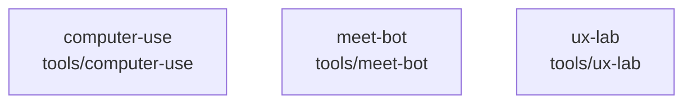

# overall-architecture/group-2/n-tools-0284c6

[解析トップへ戻る](../../../README.md)

確認したパス: `tools`。配下の登録ファイルは16件。

- `tools/computer-use/genie-computer.swift`（一覧のみ）
- `tools/meet-bot/fixture.json`（一覧のみ）
- `tools/meet-bot/join.mjs`（一覧のみ）
- `tools/meet-bot/judge-meeting.py`（一覧のみ）
- `tools/meet-bot/make-corpus.sh`（一覧のみ）
- `tools/meet-bot/package.json`（一覧のみ）
- `tools/ux-lab/README.md`（一覧のみ）
- `tools/ux-lab/axpress.swift`（一覧のみ）
- `tools/ux-lab/calm.swift`（一覧のみ）
- `tools/ux-lab/clicktest.swift`（一覧のみ）
- `tools/ux-lab/framediff.swift`（一覧のみ）
- `tools/ux-lab/motion.swift`（一覧のみ）
- `tools/ux-lab/ocr.swift`（一覧のみ）
- `tools/ux-lab/rect.swift`（一覧のみ）
- `tools/ux-lab/uxin.swift`（一覧のみ）
- `tools/ux-lab/winrect.swift`（一覧のみ）

## 要素の説明

### n-tools-computer-use-09a4d9

実在パス: `tools/computer-use`。1ファイル。

- `tools/computer-use/genie-computer.swift`

### n-tools-meet-bot-9d5219

実在パス: `tools/meet-bot`。5ファイル。

- `tools/meet-bot/fixture.json`
- `tools/meet-bot/join.mjs`
- `tools/meet-bot/judge-meeting.py`
- `tools/meet-bot/make-corpus.sh`
- `tools/meet-bot/package.json`

### n-tools-ux-lab-e83bd4

実在パス: `tools/ux-lab`。10ファイル。

- `tools/ux-lab/README.md`
- `tools/ux-lab/axpress.swift`
- `tools/ux-lab/calm.swift`
- `tools/ux-lab/clicktest.swift`
- `tools/ux-lab/framediff.swift`
- `tools/ux-lab/motion.swift`
- `tools/ux-lab/ocr.swift`
- `tools/ux-lab/rect.swift`
- `tools/ux-lab/uxin.swift`
- `tools/ux-lab/winrect.swift`

