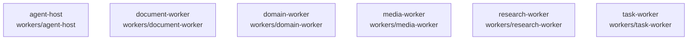

# overall-architecture/group-2/n-workers-f74e09

[解析トップへ戻る](../../../README.md)

確認したパス: `workers`。配下の登録ファイルは80件。

- `workers/agent-host/package.json`（一覧のみ）
- `workers/agent-host/src/api-session.ts`（一覧のみ）
- `workers/agent-host/src/claude-code.ts`（一覧のみ）
- `workers/agent-host/src/cloud.ts`（一覧のみ）
- `workers/agent-host/src/codex.ts`（一覧のみ）
- `workers/agent-host/src/compose-quality.ts`（一覧のみ）
- `workers/agent-host/src/computer-planner.ts`（一覧のみ）
- `workers/agent-host/src/computer-runtime.ts`（一覧のみ）
- `workers/agent-host/src/computer-vision-device.ts`（一覧のみ）
- `workers/agent-host/src/computer-vision-policy.ts`（一覧のみ）
- `workers/agent-host/src/computer-vision-prompts.ts`（一覧のみ）
- `workers/agent-host/src/computer-vision.ts`（一覧のみ）
- `workers/agent-host/src/connection-configuration.ts`（一覧のみ）
- `workers/agent-host/src/connector-steps.ts`（一覧のみ）
- `workers/agent-host/src/grants.ts`（一覧のみ）
- `workers/agent-host/src/host.ts`（一覧のみ）
- `workers/agent-host/src/http-llm.ts`（一覧のみ）
- `workers/agent-host/src/index.ts`（一覧のみ）
- `workers/agent-host/src/initial-profile.ts`（一覧のみ）
- `workers/agent-host/src/instance-lock.ts`（一覧のみ）
- `workers/agent-host/src/keychain.ts`（一覧のみ）
- `workers/agent-host/src/live-assert.ts`（一覧のみ）
- `workers/agent-host/src/live-controls.ts`（一覧のみ）
- `workers/agent-host/src/live-fault-transport.ts`（一覧のみ）
- `workers/agent-host/src/live-fixture.ts`（一覧のみ）
- `workers/agent-host/src/live-initial-profile.ts`（一覧のみ）
- `workers/agent-host/src/live-oauth.ts`（一覧のみ）
- `workers/agent-host/src/live-receipt.ts`（一覧のみ）
- `workers/agent-host/src/live-seed.ts`（一覧のみ）
- `workers/agent-host/src/llm-steps.ts`（一覧のみ）
- `workers/agent-host/src/main.ts`（一覧のみ）
- `workers/agent-host/src/runner.ts`（一覧のみ）
- `workers/agent-host/src/step-loop.ts`（一覧のみ）
- `workers/agent-host/src/step-transport.ts`（一覧のみ）
- `workers/agent-host/src/transport.ts`（一覧のみ）

## 要素の説明

### n-workers-agent-host-a5cfa4

実在パス: `workers/agent-host`。62ファイル。

- `workers/agent-host/package.json`
- `workers/agent-host/src/api-session.ts`
- `workers/agent-host/src/claude-code.ts`
- `workers/agent-host/src/cloud.ts`
- `workers/agent-host/src/codex.ts`
- `workers/agent-host/src/compose-quality.ts`
- `workers/agent-host/src/computer-planner.ts`
- `workers/agent-host/src/computer-runtime.ts`
- `workers/agent-host/src/computer-vision-device.ts`
- `workers/agent-host/src/computer-vision-policy.ts`
- `workers/agent-host/src/computer-vision-prompts.ts`
- `workers/agent-host/src/computer-vision.ts`
- `workers/agent-host/src/connection-configuration.ts`
- `workers/agent-host/src/connector-steps.ts`
- `workers/agent-host/src/grants.ts`
- `workers/agent-host/src/host.ts`
- `workers/agent-host/src/http-llm.ts`
- `workers/agent-host/src/index.ts`
- `workers/agent-host/src/initial-profile.ts`
- `workers/agent-host/src/instance-lock.ts`
- `workers/agent-host/src/keychain.ts`
- `workers/agent-host/src/live-assert.ts`
- `workers/agent-host/src/live-controls.ts`
- `workers/agent-host/src/live-fault-transport.ts`
- `workers/agent-host/src/live-fixture.ts`

### n-workers-document-worker-448c93

実在パス: `workers/document-worker`。3ファイル。

- `workers/document-worker/package.json`
- `workers/document-worker/src/index.ts`
- `workers/document-worker/tsconfig.json`

### n-workers-domain-worker-32db39

実在パス: `workers/domain-worker`。3ファイル。

- `workers/domain-worker/package.json`
- `workers/domain-worker/src/index.ts`
- `workers/domain-worker/tsconfig.json`

### n-workers-media-worker-aa3374

実在パス: `workers/media-worker`。3ファイル。

- `workers/media-worker/package.json`
- `workers/media-worker/src/index.ts`
- `workers/media-worker/tsconfig.json`

### n-workers-research-worker-1ef7c3

実在パス: `workers/research-worker`。3ファイル。

- `workers/research-worker/package.json`
- `workers/research-worker/src/index.ts`
- `workers/research-worker/tsconfig.json`

### n-workers-task-worker-fd7b7b

実在パス: `workers/task-worker`。6ファイル。

- `workers/task-worker/package.json`
- `workers/task-worker/src/worker-main.ts`
- `workers/task-worker/test/agent.e2e.test.ts`
- `workers/task-worker/test/meeting.e2e.test.ts`
- `workers/task-worker/test/research.e2e.test.ts`
- `workers/task-worker/tsconfig.json`

